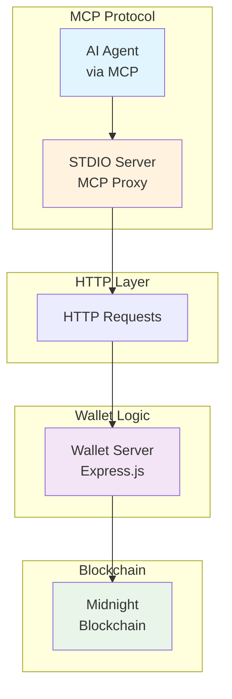

# Midnight MCP Server

A Model Context Protocol (MCP) server implementation with STDIO transport for the Midnight network.

## Overview

This server implements the Model Context Protocol for integration with the Midnight cryptocurrency network. It provides a standard interface for AI models to interact with the Midnight blockchain, wallet functionality, and other network services.

The architecture consists of two main components:
1. **Wallet Server** (`server.ts`) - An Express.js HTTP server that runs the wallet logic and exposes REST API endpoints
2. **STDIO Server** (`stdio-server.ts`) - An MCP-compliant server that acts as a proxy, forwarding tool calls to the wallet server via HTTP requests

## Prerequisites

- Node.js (v18.20.5)
- Yarn package manager
- Docker and Docker Compose (for production deployment)

## Setup and Installation

### 1. Install Dependencies

```bash
yarn install
```

### 2. Development Setup (Local)

For local development, set up an agent and run the development server:

#### Set Up Agent

```bash
# Set up a new agent with an auto-generated seed
yarn setup-agent -a agent-123

# Set up a new agent in a specific directory
yarn setup-agent -a agent-123 -d /path/to/your/project

# Or provide your own seed
yarn setup-agent -a agent-123 -s "your-seed-here"

# Force overwrite existing seed file
yarn setup-agent -a agent-123 -f

# Additional options:
# -w, --words <number>    Number of words in mnemonic (12 or 24, default: 24)
# -p, --password <string> Optional password for additional security
```

The script will:
1. Create the necessary directory structure
2. Generate or verify the provided seed
3. Display the generated wallet information:
   - Midnight Seed (hex)
   - BIP39 Mnemonic
   - Derived Seed (if password was provided)

**IMPORTANT:** Save these values securely. The seed and mnemonic provide access to your funds.

**NOTE:** The BIP39 mnemonic can be imported into any GUI wallet that supports the Midnight blockchain, providing direct access to your funds.

#### Configure Environment Variables

Create a `.env` file with the necessary configuration values:

```bash
# Copy the example .env file and customize it
cp .env.example .env
```

Edit the `.env` file to include your agent ID and wallet server configuration:

```env
# Required
AGENT_ID=agent-123

# Wallet Server Configuration
WALLET_SERVER_HOST=localhost
WALLET_SERVER_PORT=3000

# Network Configuration
NETWORK_ID=TestNet
WALLET_FILENAME=midnight-wallet
LOG_LEVEL=info

# External Services (if using external proof server)
USE_EXTERNAL_PROOF_SERVER=true
PROOF_SERVER=http://proof-server:8080
INDEXER=http://indexer:8080
INDEXER_WS=ws://indexer:8080
MN_NODE=http://midnight-node:8080
```

#### Run Development Server

```bash
# Start the development server
yarn dev
```

This will start the wallet server in development mode with hot reloading.

### 3. Production Setup (Docker)

For production deployment, use the Docker setup which creates an isolated environment for each agent:

#### Set Up Docker Environment

```bash
# Set up a new agent for Docker deployment
yarn setup-docker -a agent-123

# Set up with custom configuration
yarn setup-docker -a agent-123 -P 3001 -i http://custom-indexer:8080

# Additional options:
# -s, --seed <seed>           Wallet seed (if not provided, will be generated)
# -f, --force                 Overwrite existing seed file if it exists
# -w, --words <number>        Number of words in mnemonic (12 or 24, default: 24)
# -p, --password <string>     Optional password for additional security
# -P, --port <number>         Wallet server port (default: 3000)
# -i, --indexer <url>         Indexer URL (default: http://indexer:8080)
# -w, --indexer-ws <url>      Indexer WebSocket URL (default: ws://indexer:8080)
# -n, --node <url>            Midnight node URL (default: http://midnight-node:8080)
```

This script will:
1. Create a new directory structure in `agents/<agent-id>/`
2. Generate a secure seed file
3. Create a `.env` file with the appropriate configuration
4. Copy the `docker-compose.yml` file to the agent directory
5. Set up data and logs directories with proper permissions

#### Deploy with Docker Compose

Navigate to the agent directory and start the services:

```bash
# Change to the agent directory
cd agents/agent-123

# Build and start the containers
docker-compose up -d

# Check the logs
docker-compose logs -f wallet-server

# To stop the containers
docker-compose down

# To remove all data (including volumes)
docker-compose down -v
```

The Docker setup includes:
- **Proof Server**: Midnight proof server for cryptographic operations
- **Wallet Server**: The main wallet service with persistent storage
- **Health Checks**: Automatic health monitoring
- **Volume Mounting**: Persistent data storage for wallet state

### 4. Building for Production

#### Build the Application

```bash
# Build the application
yarn build
```

#### Run Production Server

```bash
# Start the production server
yarn start
```

The stdio-server provides a standard input/output interface that conforms to the Model Context Protocol, allowing AI models to communicate with the Midnight network via HTTP requests to the wallet server.

## Architecture



### Component Responsibilities

1. **STDIO Server** (`stdio-server.ts`):
   - Implements the Model Context Protocol
   - Receives tool calls from AI agents
   - Forwards requests to the wallet server via HTTP
   - Returns responses back to the AI agent

2. **Wallet Server** (`server.ts`):
   - Runs the actual wallet logic
   - Exposes REST API endpoints
   - Manages wallet state and blockchain interactions
   - Handles all wallet operations (balance, transactions, etc.)

## MCP Server Configuration for AI Models

JSON Config:

```json
"mcp": {
    "servers": {
      "midnight-mcp": {
        "type": "stdio",
        "name": "Midnight MCP",
        "command": "bash",
        "args": [
          "-c",
          "source ~/.nvm/nvm.sh && AGENT_ID=<agent-id> nvm exec 22.15.1 node <path>/midnight-mcp/dist/stdio-server.js"
        ]
      }
    }
  }
```

### Agent ID Configuration

The MCP server supports multiple agents running simultaneously through the use of agent IDs. Each agent gets its own isolated storage space for wallet data and transactions.

#### Setting Agent ID

You can set the agent ID in two ways:

1. **Through Environment Variable** (Required):
```json
"args": [
  "-c",
  "source ~/.nvm/nvm.sh && nvm exec 22.15.1 AGENT_ID=agent-123 yarn start:mcp"
]
```

#### Storage Structure

Each agent's data is stored in an isolated directory:
```
storage/
  ├── seeds/
  │   ├── agent-123/
  │   │   └── seed
  │   └── agent-456/
  │       └── seed
  ├── wallet-backups/
  │   ├── agent-123/
  │   │   ├── wallet-1.json
  │   │   └── wallet-1-transactions.db
  │   └── agent-456/
  │       ├── wallet-1.json
  │       └── wallet-1-transactions.db
  └── logs/
      ├── agent-123/
  │       └── wallet-app.log
  └── agent-456/
      └── wallet-app.log
```

For development, you can run with an agent ID:
```bash
AGENT_ID=agent-123 yarn dev
```

NOTE: Replace `<path>` with the absolute path to directory where you cloned the `midnight-mcp` repository.

## Integrating with ElizaOS

### Install ElizaOS

Install Node.js: Ensure you have Node.js 23.3.0+ installed on your system. You can download and install it from the official Node.js website: https://docs.npmjs.com/downloading-and-installing-node-js-and-npm

Install the ElizaOS CLI: Run the following command in your terminal:

```bash
npm install -g @elizaos/cli@beta
```

This will install the ElizaOS CLI globally on your system.

Verify the Installation: After the installation is complete, verify that the ElizaOS CLI is working by running the following command:

```bash
elizaos --version
```

This should display the version of the ElizaOS CLI installed on your system.

To create a new Eliza project using the eliza create command, follow these steps:

1. Open a Terminal: Open a terminal window on your system.
2. Run the eliza create Command: Run the following command in the terminal:

```bash
elizaos create
```

This will launch the ElizaOS project creation wizard:

3. Follow the Wizard: Follow the prompts in the wizard to configure your new Eliza project. You will be asked to provide some basic project information, such as the project name and description.
4. Create the Project: After filling in the required information, the wizard will create a new Eliza project for you. This may take a few seconds to complete.
5. Navigate to the Project Directory: Once the project is created, navigate to the project directory using the cd command:

```bash
cd my-project-name
```

Replace my-project-name with the actual name of your project.

```bash
elizaos start
```

This will launch the ElizaOS server and make the agent accessible via the web interface at https://localhost:3000.

You now have a new Eliza project up and running!

### Install the MCP Plugin for ElizaOS

Inside your eliza project run:

```bash
bun add @fleek-platform/eliza-plugin-mcp
```

Now in the character.json file that you'll use to create your AI Agent add the mcp json structure shown above.

All set! You're ready to use AI agents with on-chain capabilities for the Midnight blockchain.

## E2E Testing with ElizaOS

This project includes comprehensive End-to-End testing that validates the integration between the Midnight MCP server and ElizaOS using the [@fleek-platform/eliza-plugin-mcp](https://github.com/fleek-platform/eliza-plugin-mcp).

### Quick Demo

Run the interactive demo to see ElizaOS + MCP integration in action:

```bash
yarn demo:eliza
```

This will:
1. Check prerequisites and install ElizaOS CLI if needed
2. Create a demo ElizaOS project with MCP integration
3. Configure the Midnight MCP server connection
4. Provide instructions to start the agent

### E2E Test Suites

Run different types of E2E tests:

```bash
# Direct MCP protocol testing
yarn test:e2e

# STDIO JSON-RPC testing
yarn test:e2e:stdio

# ElizaOS integration testing  
yarn test:e2e:eliza

# Comprehensive test suite
yarn test:e2e:full

# Interactive demo
yarn demo:eliza
```

### ElizaOS Integration Features

The MCP server integrates with ElizaOS to provide:

- **AI Agent Conversations**: Natural language interactions with blockchain tools
- **Automatic Tool Discovery**: MCP tools are automatically available to agents
- **Contextual Help**: Agents understand Midnight blockchain concepts
- **Error Handling**: Graceful error handling in conversational context
- **Real-time Updates**: Live wallet and transaction status updates

### Available MCP Tools for Agents

When integrated with ElizaOS, agents have access to these tools:

- `walletStatus` - Check wallet synchronization status
- `walletAddress` - Get wallet receiving address
- `walletBalance` - View current balance
- `getTransactions` - List transaction history
- `sendFunds` - Send funds to another address
- `verifyTransaction` - Verify transaction status
- `getWalletConfig` - Get wallet configuration

### Example Agent Conversations

```
User: "Hello! Can you check my wallet status?"
Agent: "I'll check your wallet status for you! 💰 Let me connect to the Midnight network..."

User: "What's my current balance?"
Agent: "Let me check your current balance on the Midnight network. 🔍"

User: "Show me my recent transactions"
Agent: "I'll fetch your recent transactions from the Midnight blockchain. ⛓️"
```

For detailed E2E testing documentation, see [test/e2e/README.md](test/e2e/README.md).
