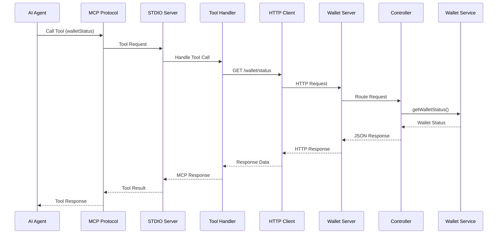
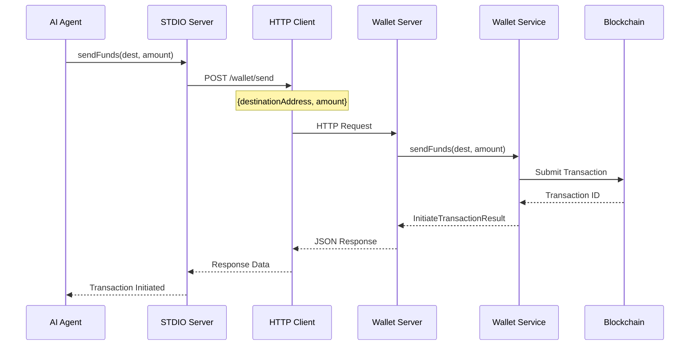
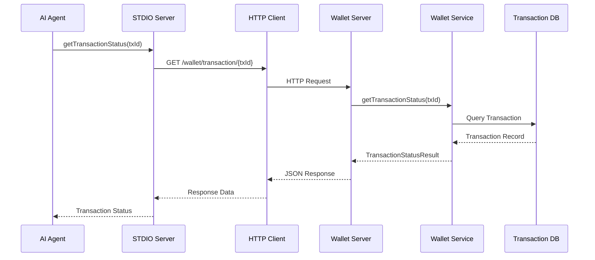
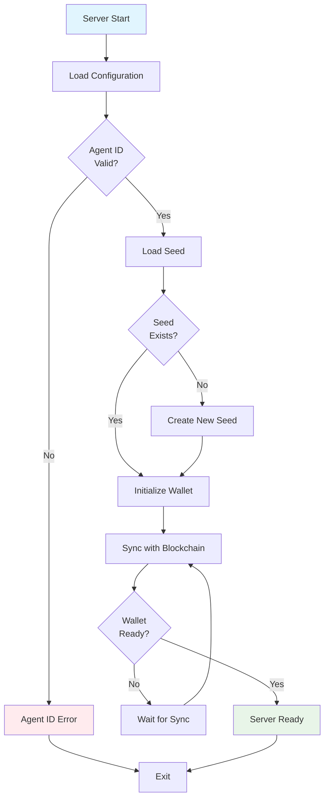
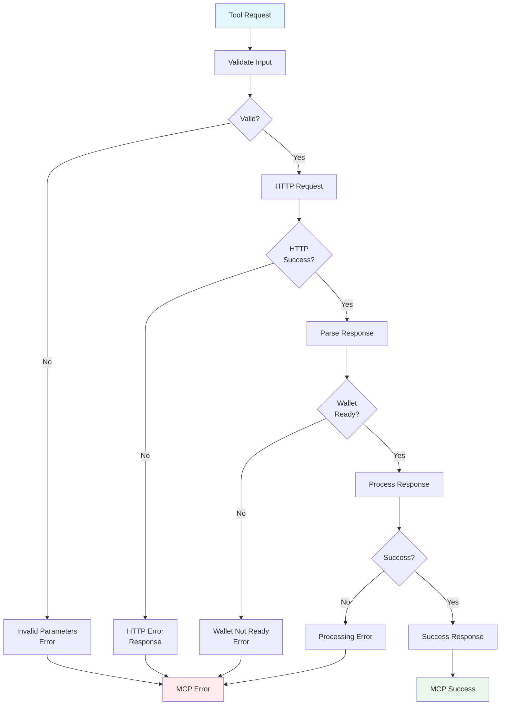
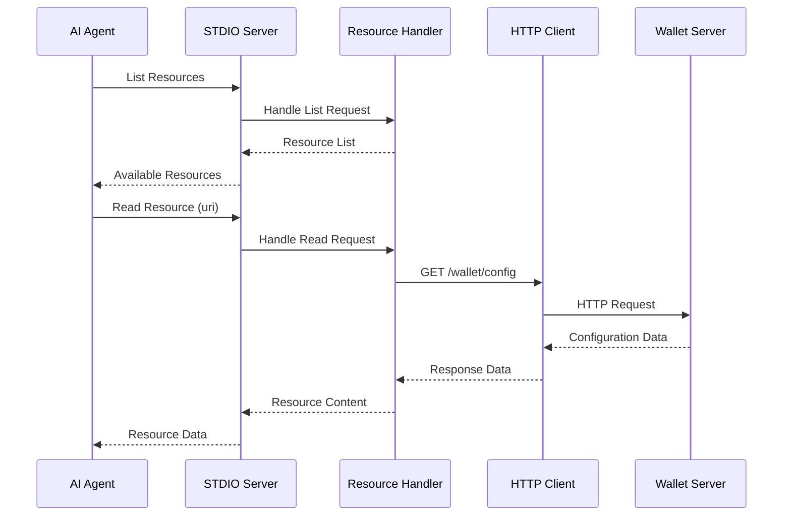
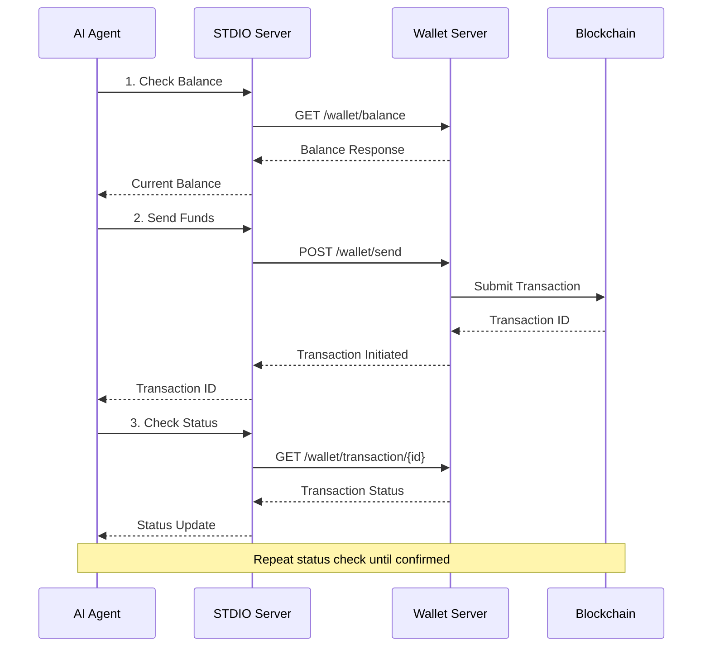
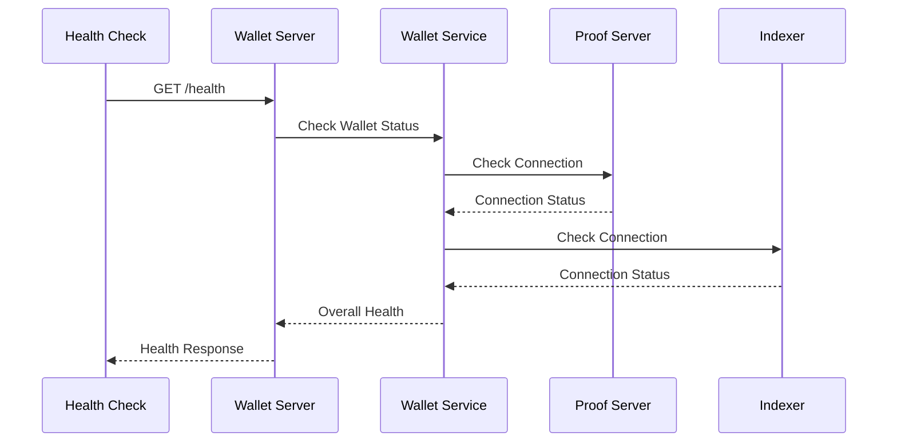
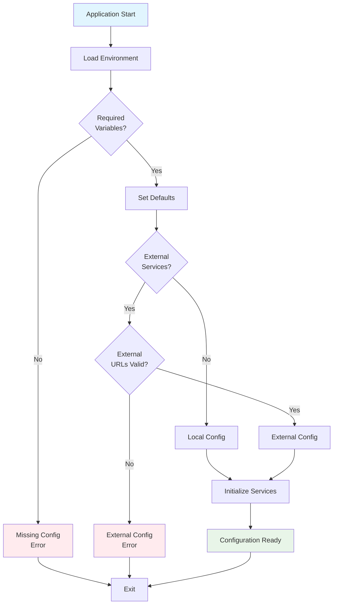

# Midnight MCP API Flow Diagrams

This document contains Mermaid diagrams showing the API flows, tool interactions, and request/response patterns for the Midnight MCP server.

## Tool Call Flow

## Send Funds Flow

## Transaction Status Flow

## Wallet Initialization Flow

## Error Handling Flow

## Resource Management Flow

## Multi-Step Transaction Flow

## Health Check Flow

## Configuration Flow

