# Midnight MCP System Design

This document contains comprehensive Mermaid diagrams showing the system architecture, API flows, data flow, and deployment scenarios for the Midnight MCP server.

## System Architecture

### Overview Architecture

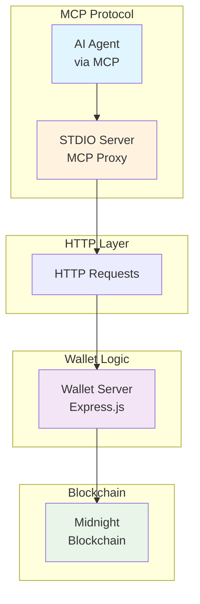

### Detailed Component Architecture

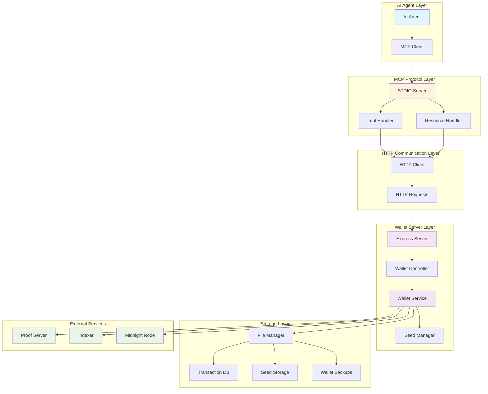

### Security Architecture

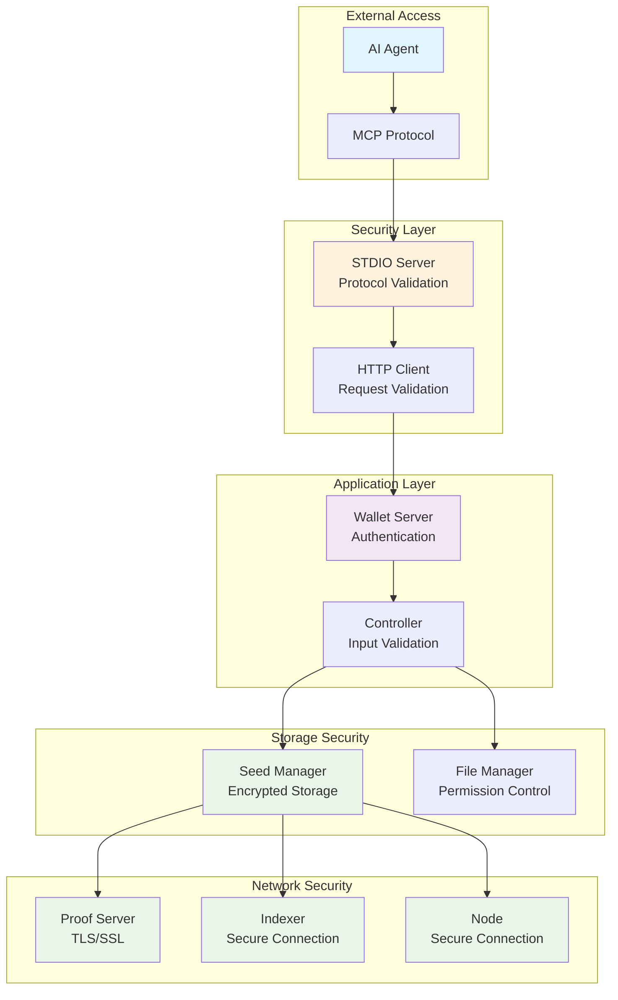

### Multi-Agent Architecture

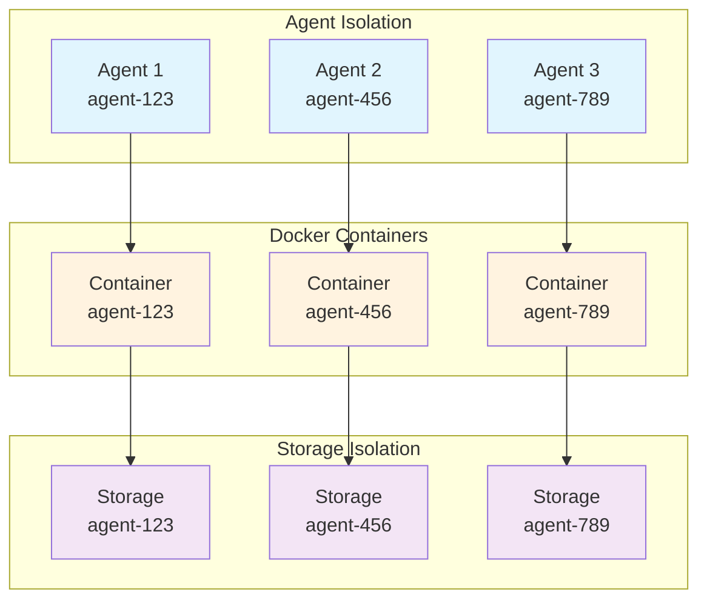

## API Flow Diagrams

### Tool Call Flow

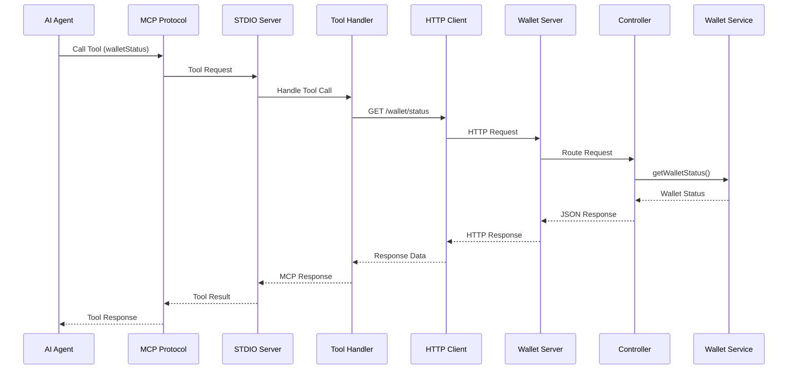

### Send Funds Flow

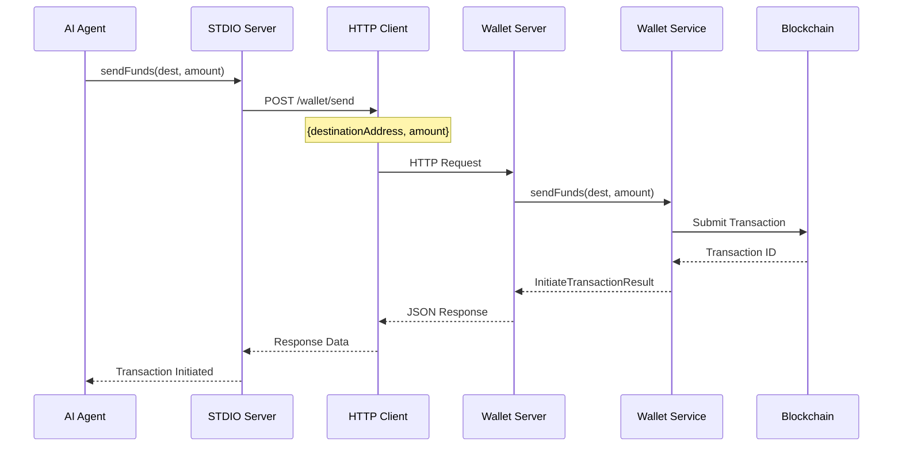

### Transaction Status Flow

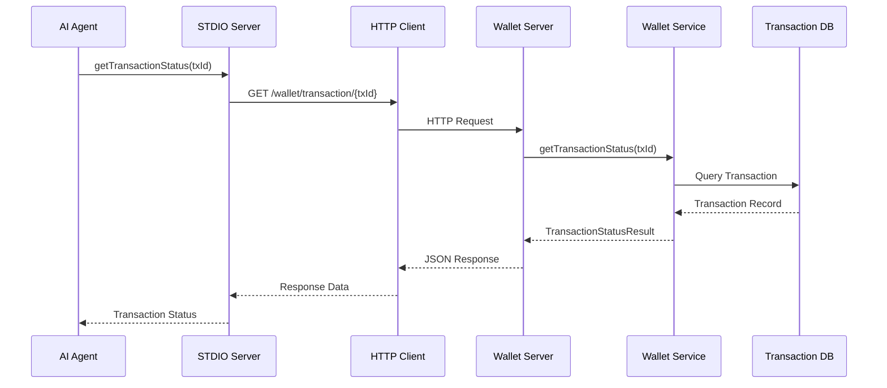

### Multi-Step Transaction Flow

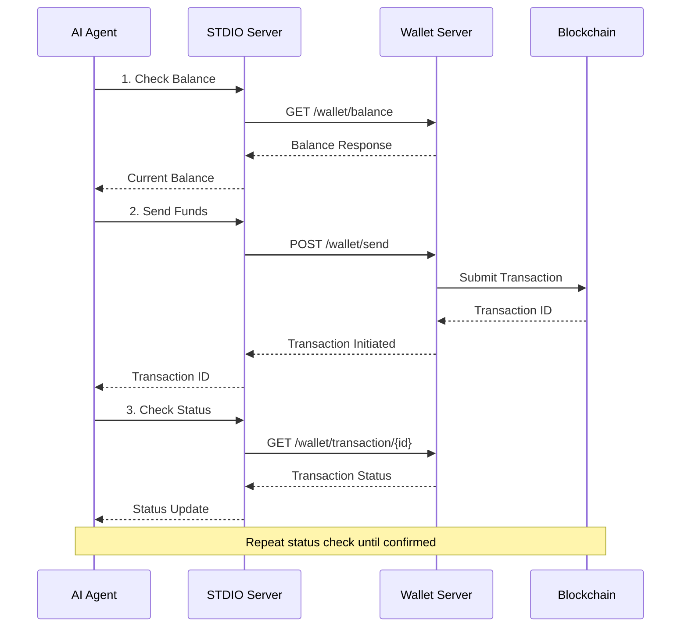

### Resource Management Flow

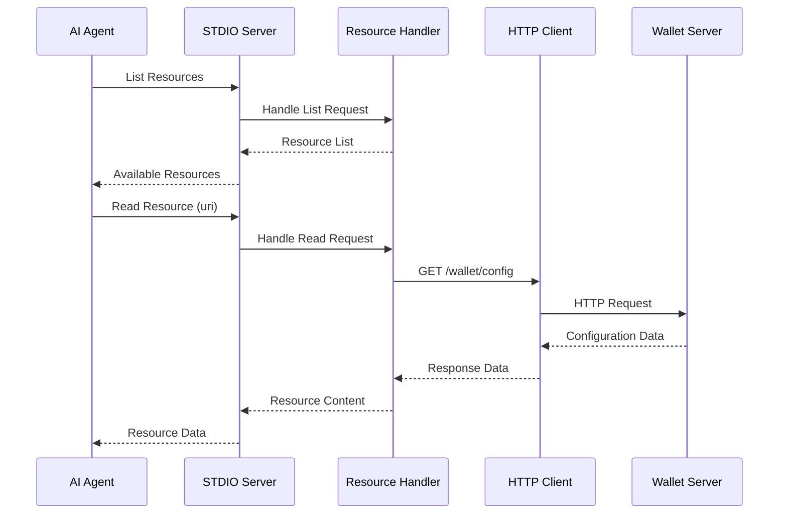

### Health Check Flow

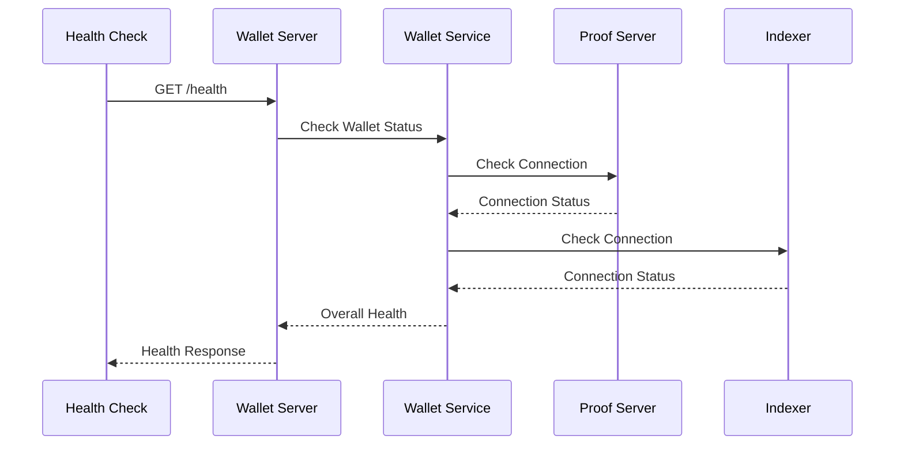

## Data Flow and Processing

### Data Flow Diagram

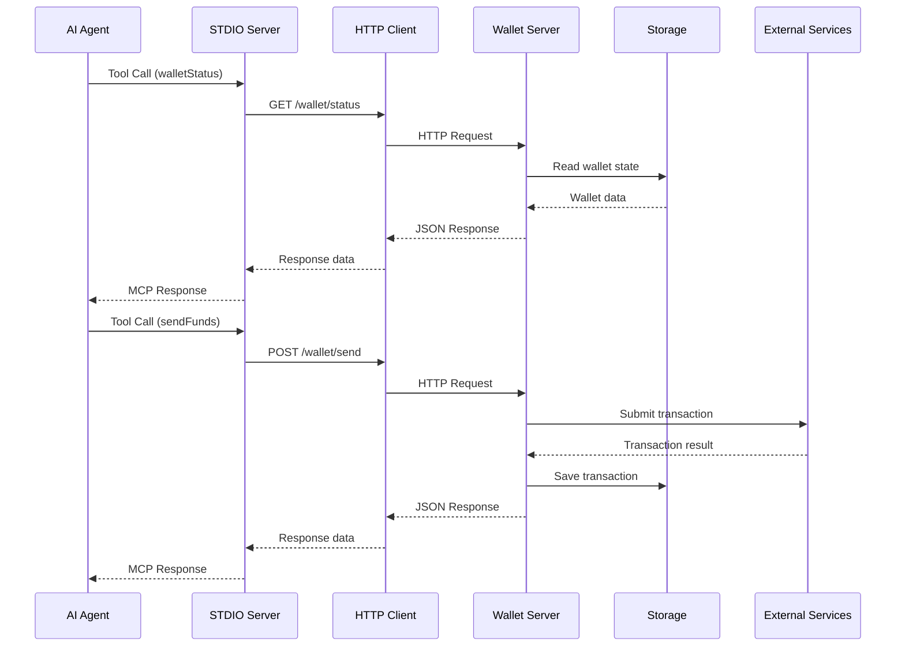

### Wallet Initialization Flow

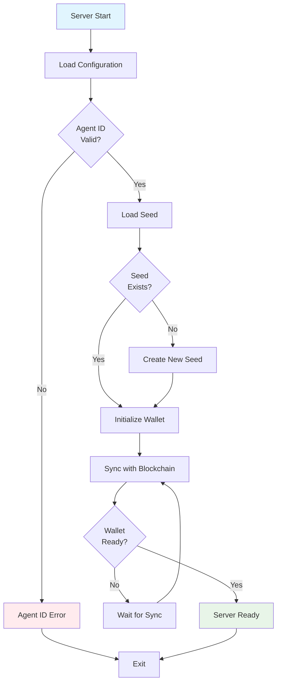

### Configuration Flow

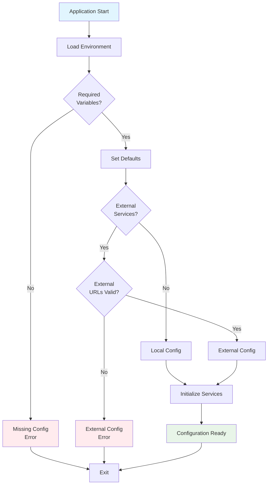

## Error Handling and Validation

### Error Handling Flow

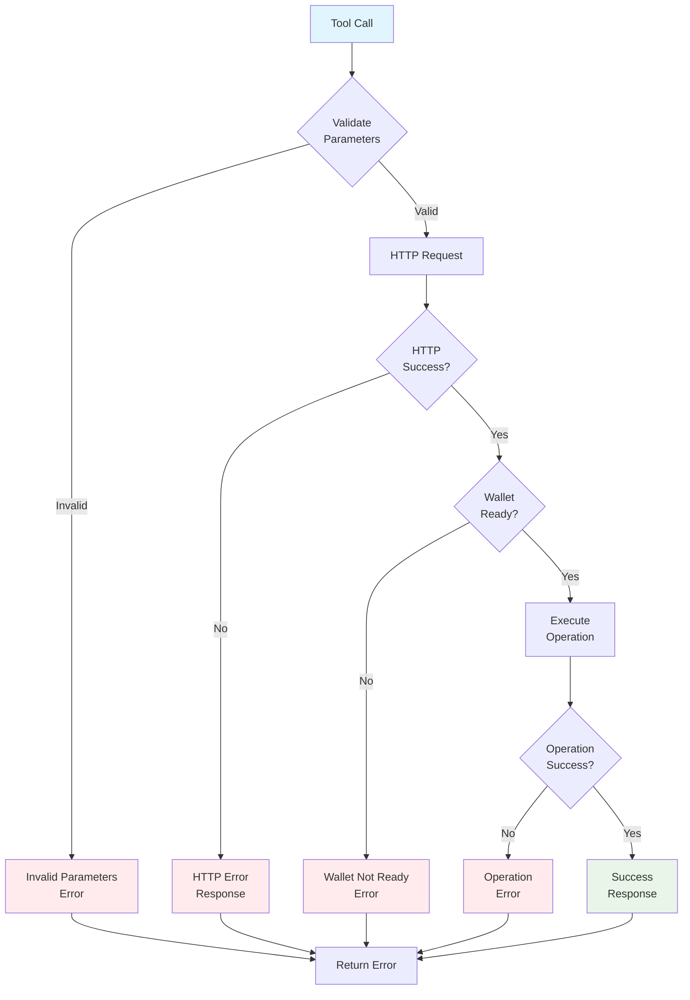

### API Error Handling Flow

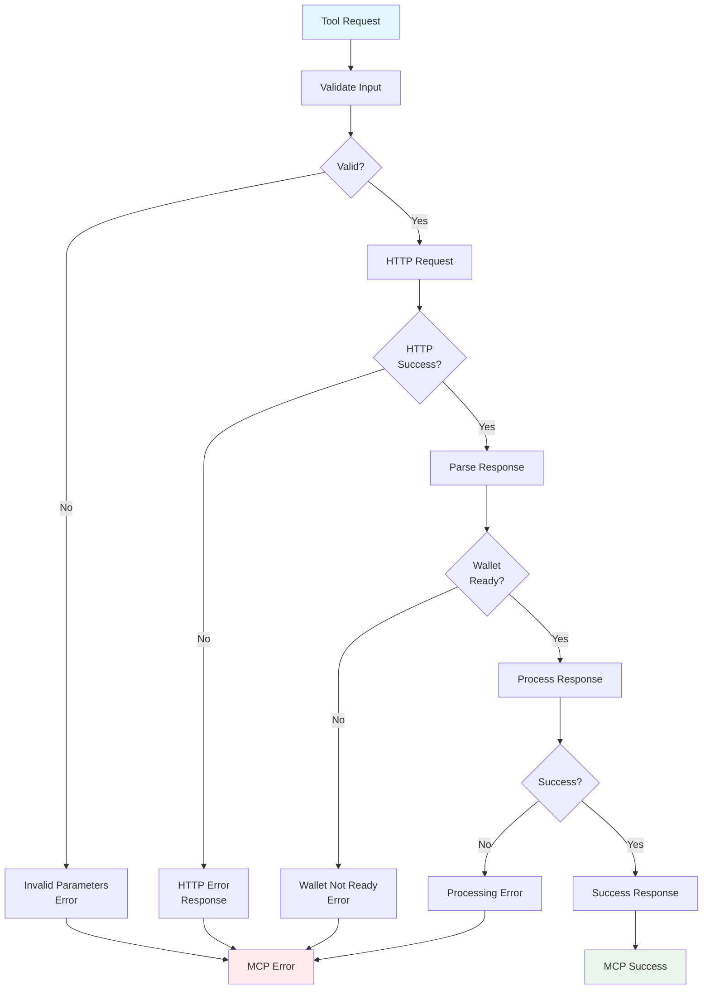

## Deployment Scenarios

### Development vs Production Deployment

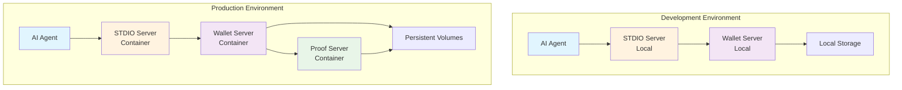