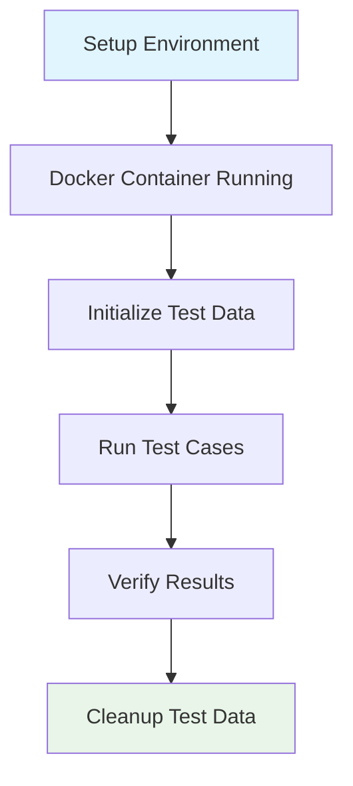

# Test Cases Documentation

This directory contains detailed documentation for all test cases in the wallet MCP system.

## Test Case Files

All test cases are documented in individual files for better organization and maintainability:

### Core Test Cases (1-4)
- **Test Case 1**: [Valid Payment Received](./test-1-valid-payment.md)
  - Ensure a transaction is received from a registered agent with the correct amount
  - Tests positive validation scenarios with proper registration and amount

- **Test Case 2**: [Payment With Wrong Amount](./test-2-wrong-amount.md)
  - Test behavior when a transaction is received from a valid sender but the amount is incorrect
  - Tests amount validation and error handling for mismatched amounts

- **Test Case 3**: [Payment From Unknown Sender](./test-3-unknown-sender.md)
  - Simulate a transaction from a wallet that has not registered as an agent
  - Tests registration validation and security for unregistered senders

- **Test Case 4**: [No Payment Received](./test-4-no-payment.md)
  - Validate system behavior when no transaction matching the criteria is found
  - Tests graceful handling of empty states and timeouts

### Extended Test Cases (5-8)
- **Test Case 5**: [Valid Identity Match](./test-5-identity-match.md)
  - Verify that the sender of the on-chain transaction matches the identity stored in the registration contract
  - Tests identity validation between on-chain transactions and off-chain registration

- **Test Case 6**: [Agent Not Registered](./test-6-agent-not-registered.md)
  - Validate that the system properly rejects a sender address that is not found in the registration contract
  - Tests registration validation and error handling

- **Test Case 7**: [Sender Mismatch With Off-chain Session](./test-7-sender-mismatch.md)
  - Ensure the sender of the on-chain transaction does not match the off-chain session identity
  - Tests session management and identity mismatch detection

- **Test Case 8**: [Duplicate Transaction Detection](./test-8-duplicate-transaction.md)
  - Ensure the system detects and ignores repeated processing of the same transaction
  - Tests duplicate detection and transaction tracking

## Test Environment Setup

### Prerequisites
- Docker container for wallet interaction is started manually
- Setup script for initial transactions is executed prior to test execution
- Tests focus on verification rather than creating new transactions

### Test Execution Flow

## Test Categories

### Validation Tests
- **Tests 1, 5**: Positive validation scenarios
- **Tests 2, 3, 6, 7**: Negative validation scenarios
- **Test 4**: Edge case handling

### Security Tests
- **Tests 3, 6, 7**: Authentication and authorization
- **Test 8**: Data integrity and duplicate prevention

### Integration Tests
- **All Tests**: End-to-end wallet and blockchain integration
- **Tests 5, 7**: Session management integration

## Diagrams

### Generated Diagrams
The `diagrams/` directory contains generated PNG files:
- `send-funds.png`: Wallet send funds flow
- `wallet-status.png`: Wallet status check flow

### Mermaid Diagrams
Each test case file contains:
- Sequence diagrams showing interaction flow
- Flow charts for decision logic
- API call diagrams
- Database schema diagrams (where applicable)
- Error handling flows
- Validation logic diagrams

## Running Tests

### Automated Setup
1. Run full test suite: `npm run test:integration`
2. View results in test output
3. Check generated diagrams in `diagrams/` directory

## Test Data Management

### Pre-test Setup
- Agent registration in blockchain
- Initial wallet balance setup
- Test transaction preparation

### Post-test Cleanup
- Transaction history verification
- Balance reconciliation
- Session cleanup

## API Endpoints Used

### Core Endpoints
- `GET /wallet/status` - Check wallet status
- `GET /wallet/balance` - Get current balance
- `GET /wallet/transactions` - List transactions
- `GET /wallet/transaction/{id}` - Get specific transaction

### Extended Endpoints
- `GET /wallet/agent/{address}` - Get agent information
- `GET /wallet/registration/{address}` - Check registration status
- `GET /wallet/session` - Get session information
- `POST /wallet/session` - Set session context
- `GET /wallet/processed/{txId}` - Check transaction processing status
- `GET /wallet/pending` - Get pending transactions
- `GET /wallet/error/{txId}` - Get transaction error details

## File Organization

### Individual Test Files
Each test case is documented in its own file with:
- Clear description and requirements
- Detailed sequence diagrams
- Test flow charts
- HTTP API call diagrams
- Additional relevant diagrams (database schemas, error handling, etc.)

### Benefits of Individual Files
- **Maintainability**: Easy to update individual test cases
- **Clarity**: Each file focuses on one specific test scenario
- **Reusability**: Diagrams and flows can be referenced independently
- **Version Control**: Better tracking of changes per test case
- **Collaboration**: Multiple developers can work on different test cases simultaneously

## Legacy Documentation

The original `test-sequence-diagrams.md` file contains:
- Test setup flow diagrams
- Complete test suite flow
- HTTP API endpoints overview
- Test environment requirements

These diagrams provide the overall context and setup information for the test suite. 