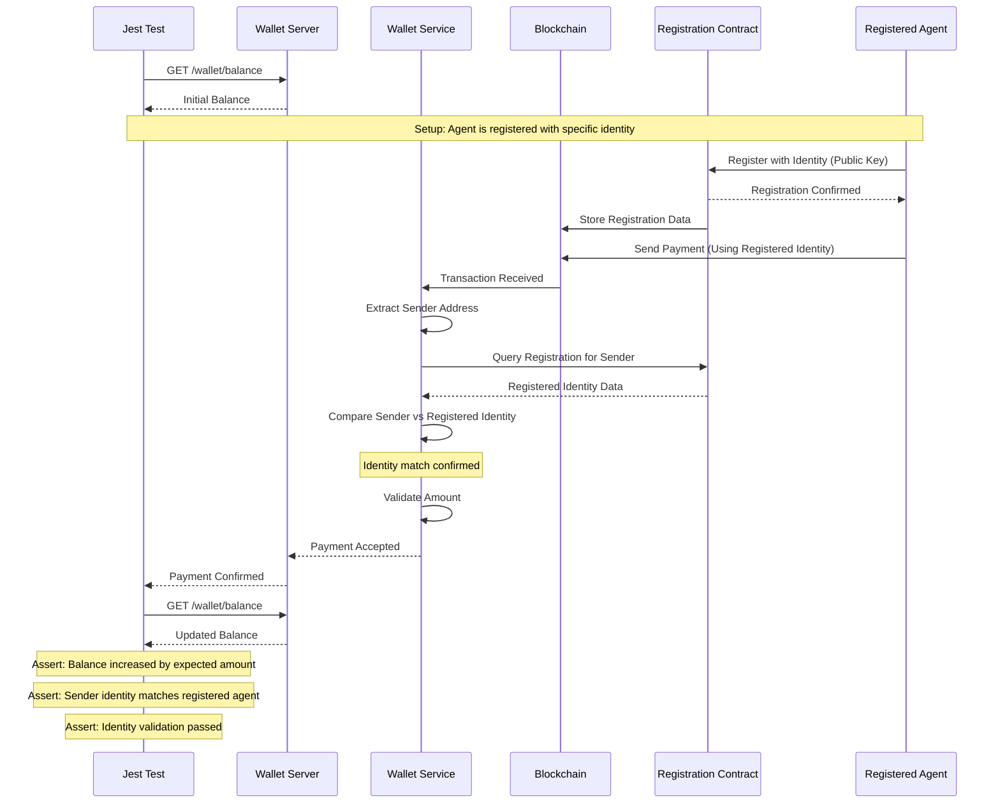
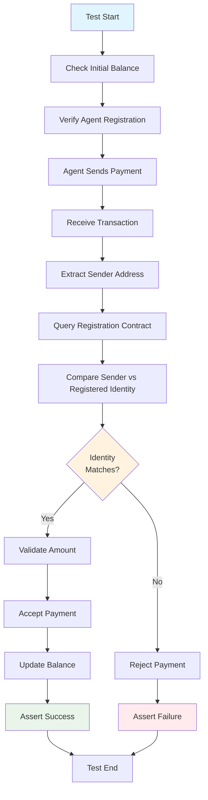

# Test Case 5: Valid Identity Match

## Description
Verify that the sender of the on-chain transaction matches the identity stored in the registration contract.

## Requirements
- Transaction sender address equals registered identity for the agent

## Sequence Diagram



## Test Flow



## HTTP API Calls

```mermaid
graph LR
    JEST[Jest Test] --> GET_BALANCE[GET /wallet/balance]
    JEST --> GET_TRANSACTION[GET /wallet/transaction/{id}]
    JEST --> GET_AGENT_INFO[GET /wallet/agent/{address}]
    
    GET_BALANCE --> WALLET[Wallet Server]
    GET_TRANSACTION --> WALLET
    GET_AGENT_INFO --> WALLET
    
    WALLET --> SERVICE[Wallet Service]
    SERVICE --> CONTRACT[Registration Contract]
    SERVICE --> BLOCKCHAIN[Blockchain]
    
    style JEST fill:#e1f5fe
    style WALLET fill:#fff3e0
    style SERVICE fill:#f3e5f5
    style CONTRACT fill:#e8f5e8
``` 