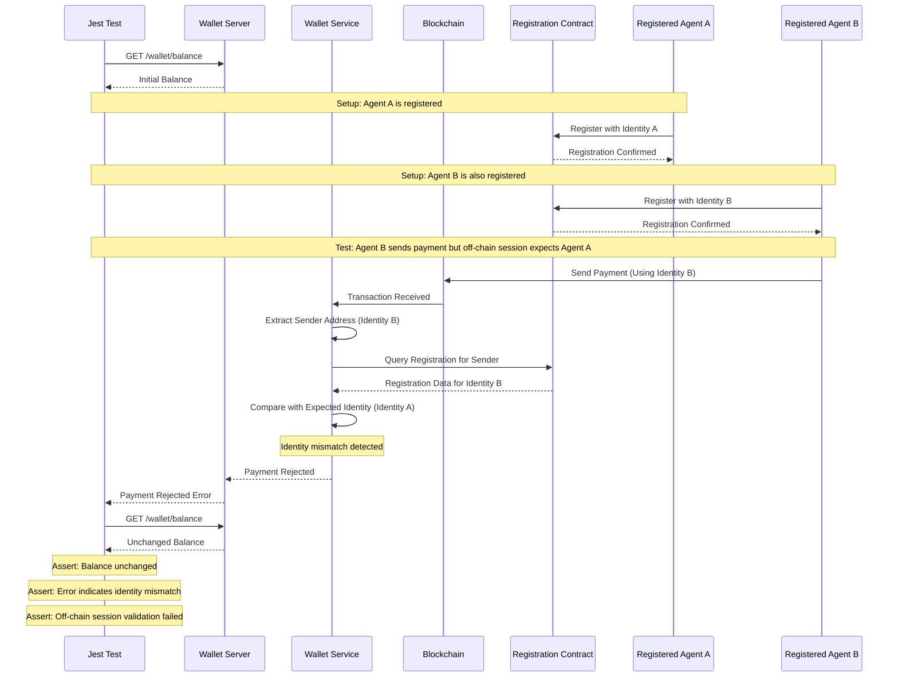
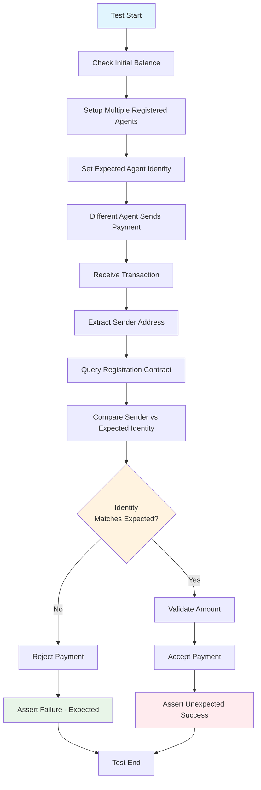
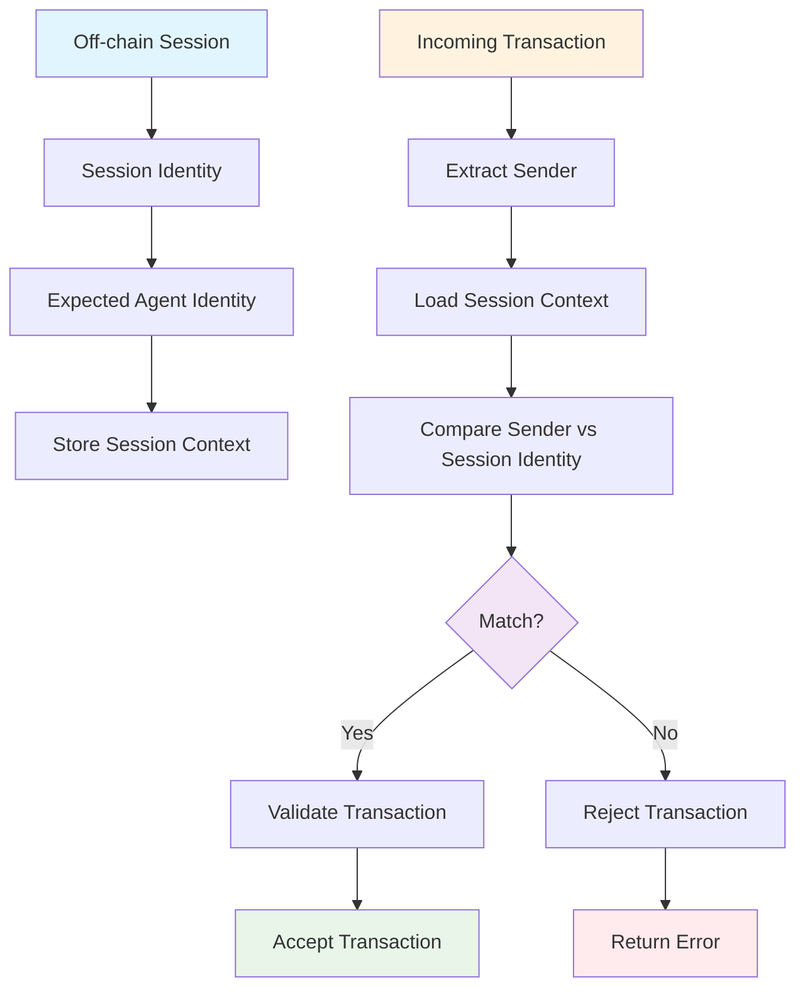
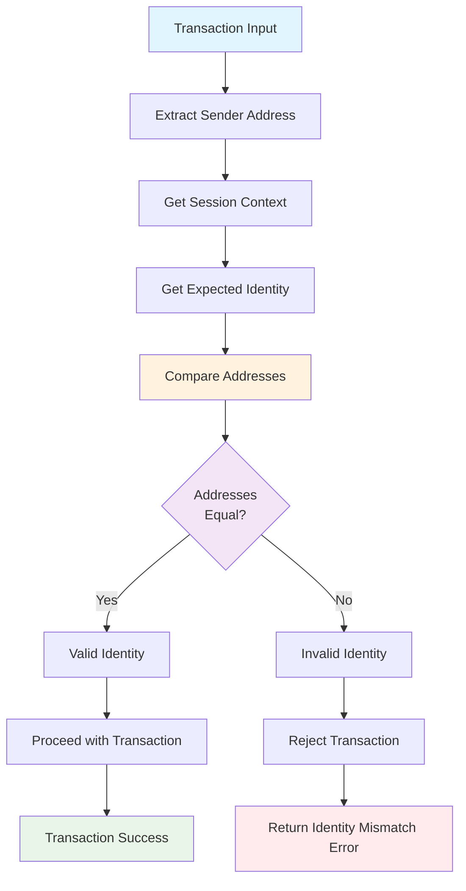

# Test Case 7: Sender Mismatch With Off-chain Session

## Description
Ensure the sender of the on-chain transaction does not match the off-chain session identity (e.g. mismatched agent pubkey).

## Requirements
- Agent is registered but does not match the off-chain caller

## Sequence Diagram



## Test Flow



## Session Management Flow



## HTTP API Calls

```mermaid
graph LR
    JEST[Jest Test] --> GET_BALANCE[GET /wallet/balance]
    JEST --> GET_TRANSACTION[GET /wallet/transaction/{id}]
    JEST --> GET_SESSION[GET /wallet/session]
    JEST --> SET_SESSION[POST /wallet/session]
    JEST --> GET_AGENT_INFO[GET /wallet/agent/{address}]
    
    GET_BALANCE --> WALLET[Wallet Server]
    GET_TRANSACTION --> WALLET
    GET_SESSION --> WALLET
    SET_SESSION --> WALLET
    GET_AGENT_INFO --> WALLET
    
    WALLET --> SERVICE[Wallet Service]
    SERVICE --> CONTRACT[Registration Contract]
    SERVICE --> BLOCKCHAIN[Blockchain]
    
    style JEST fill:#e1f5fe
    style WALLET fill:#fff3e0
    style SERVICE fill:#f3e5f5
    style CONTRACT fill:#e8f5e8
```

## Identity Validation Logic

