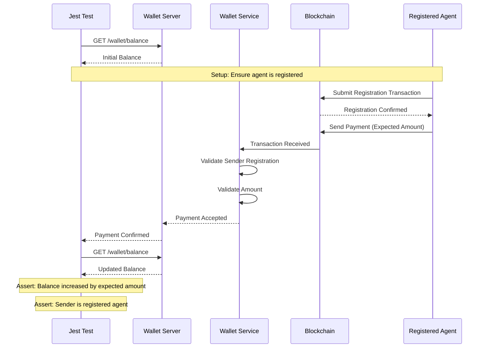
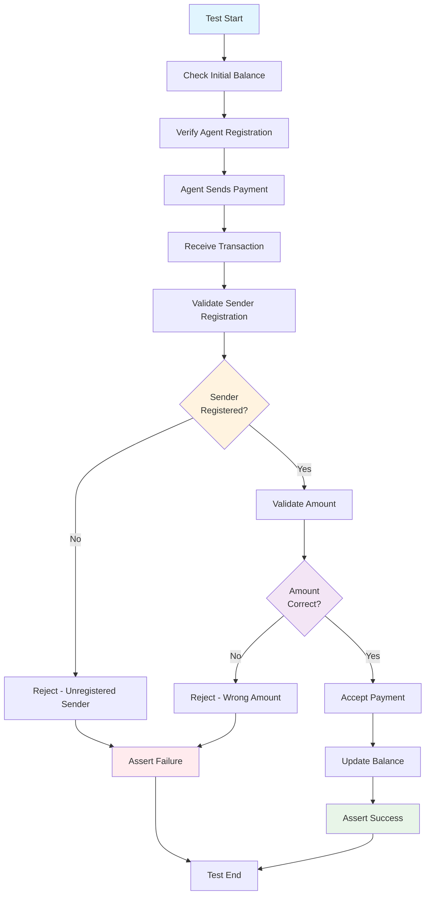
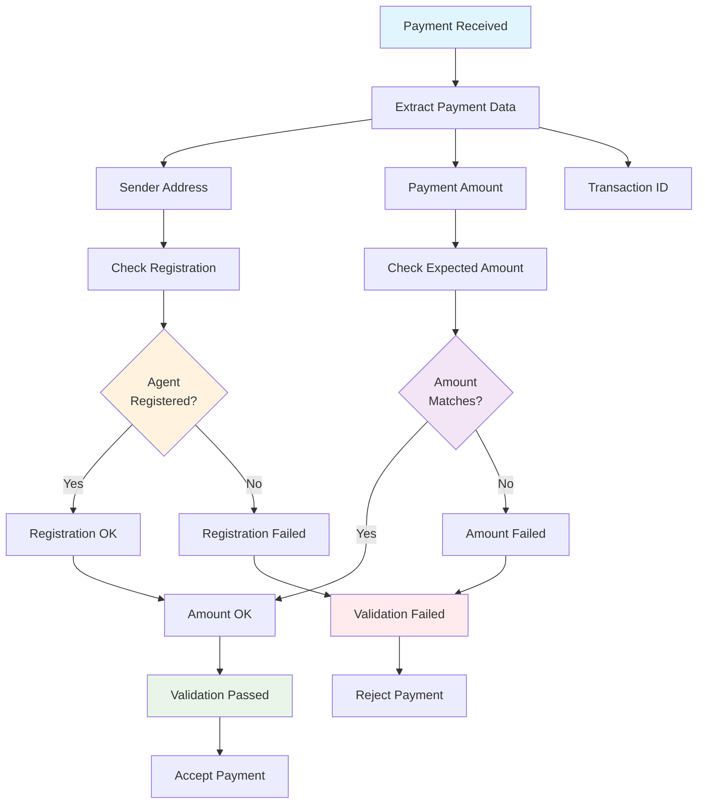
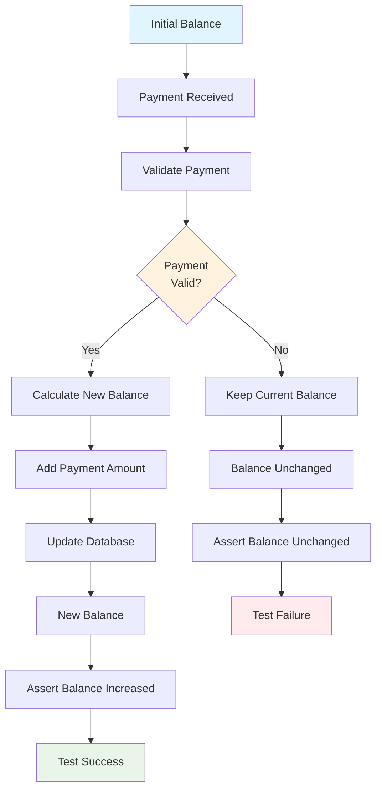

# Test Case 1: Valid Payment Received

## Description
Ensure a transaction is received from a registered agent with the correct amount.

## Requirements
- On-chain transaction with expected amount
- Sender must be a registered agent

## Sequence Diagram



## Test Flow



## HTTP API Calls

```mermaid
graph LR
    JEST[Jest Test] --> GET_BALANCE[GET /wallet/balance]
    JEST --> GET_TRANSACTION[GET /wallet/transaction/{id}]
    JEST --> GET_AGENT_INFO[GET /wallet/agent/{address}]
    JEST --> GET_TRANSACTIONS[GET /wallet/transactions]
    
    GET_BALANCE --> WALLET[Wallet Server]
    GET_TRANSACTION --> WALLET
    GET_AGENT_INFO --> WALLET
    GET_TRANSACTIONS --> WALLET
    
    WALLET --> SERVICE[Wallet Service]
    SERVICE --> BLOCKCHAIN[Blockchain]
    
    style JEST fill:#e1f5fe
    style WALLET fill:#fff3e0
    style SERVICE fill:#f3e5f5
    style BLOCKCHAIN fill:#e8f5e8
```

## Payment Validation Logic



## Balance Update Flow

