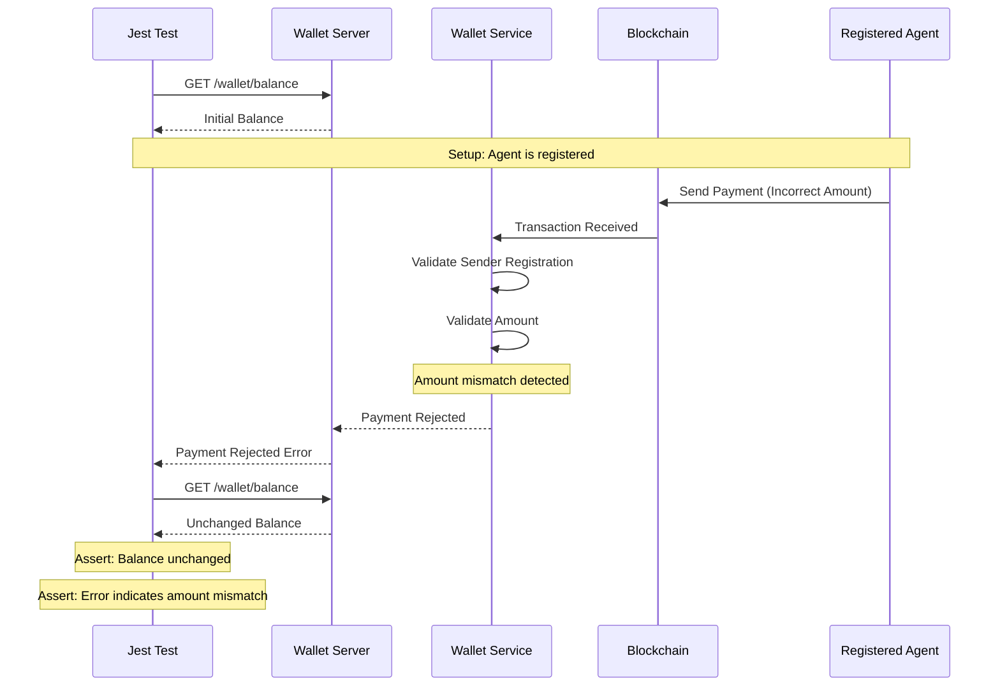
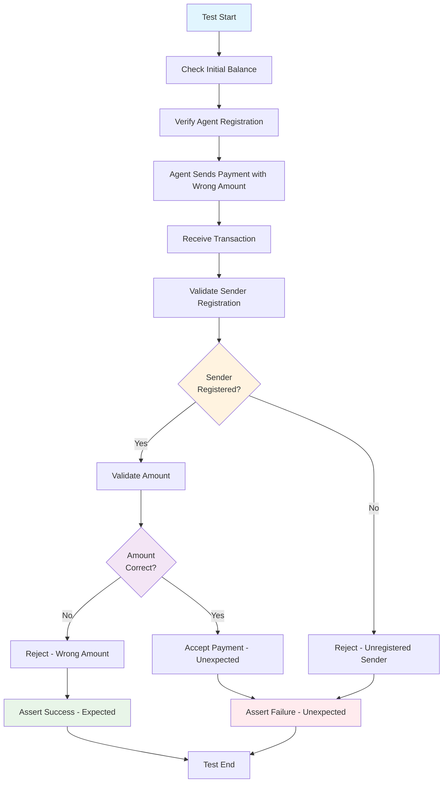
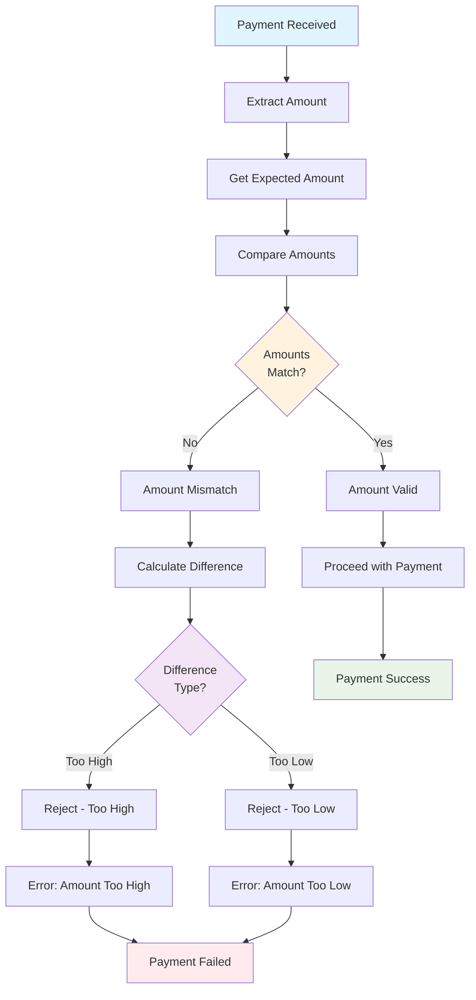
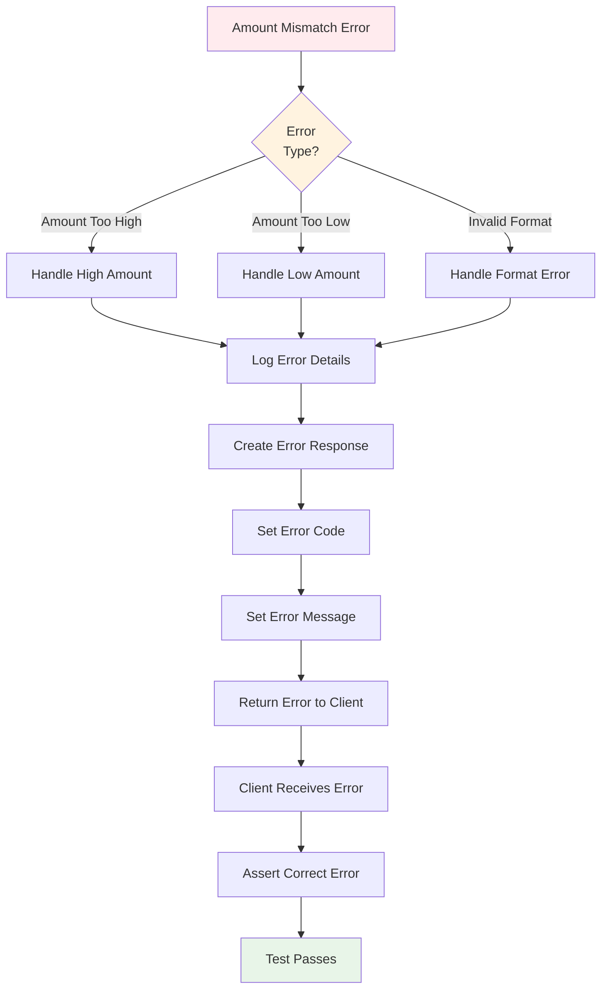
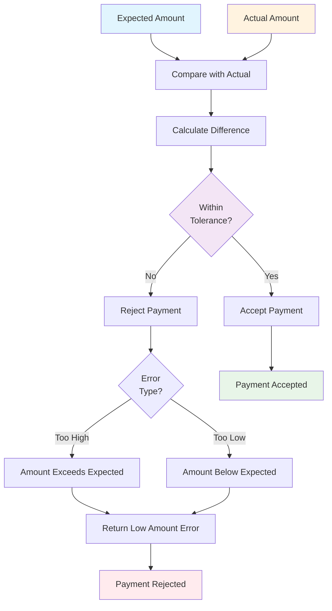

# Test Case 2: Payment With Wrong Amount

## Description
Test behavior when a transaction is received from a valid sender but the amount is incorrect.

## Requirements
- On-chain transaction with incorrect amount
- Amount mismatch should be detected in off-chain logic

## Sequence Diagram



## Test Flow



## HTTP API Calls

```mermaid
graph LR
    JEST[Jest Test] --> GET_BALANCE[GET /wallet/balance]
    JEST --> GET_TRANSACTION[GET /wallet/transaction/{id}]
    JEST --> GET_AGENT_INFO[GET /wallet/agent/{address}]
    JEST --> GET_ERROR[GET /wallet/error/{txId}]
    
    GET_BALANCE --> WALLET[Wallet Server]
    GET_TRANSACTION --> WALLET
    GET_AGENT_INFO --> WALLET
    GET_ERROR --> WALLET
    
    WALLET --> SERVICE[Wallet Service]
    SERVICE --> BLOCKCHAIN[Blockchain]
    
    style JEST fill:#e1f5fe
    style WALLET fill:#fff3e0
    style SERVICE fill:#f3e5f5
    style BLOCKCHAIN fill:#e8f5e8
```

## Amount Validation Logic



## Error Handling Flow



## Expected vs Actual Amount Comparison

