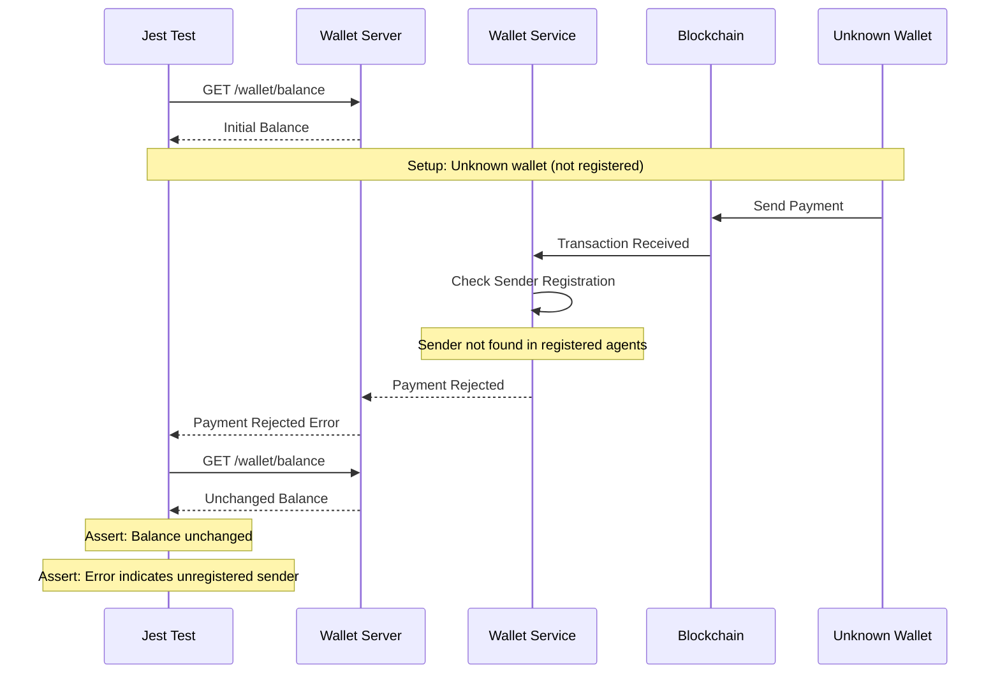
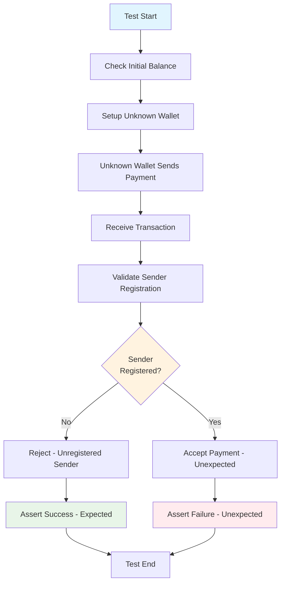
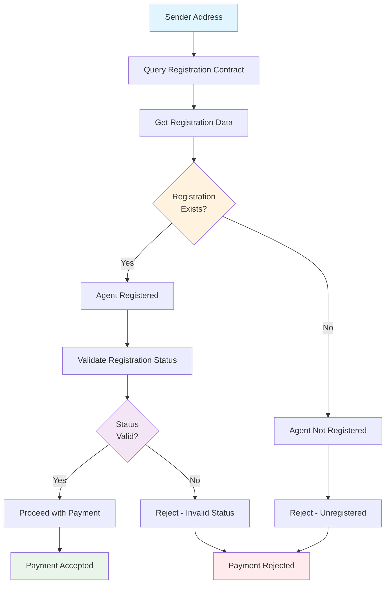
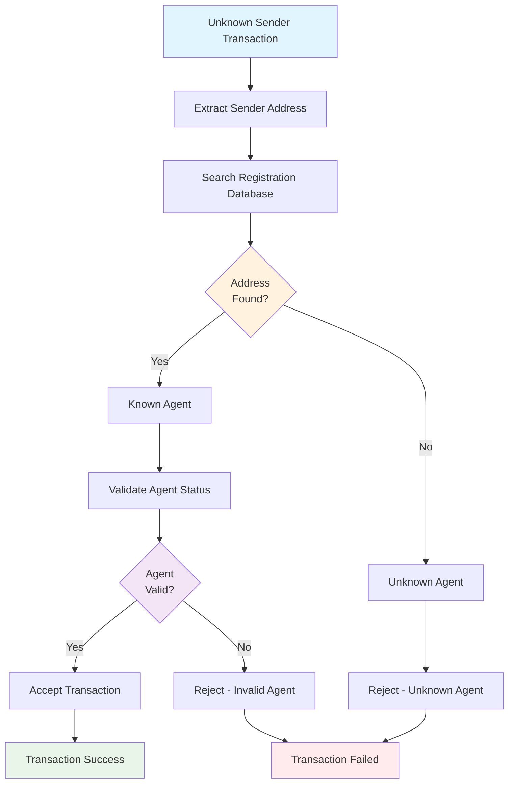
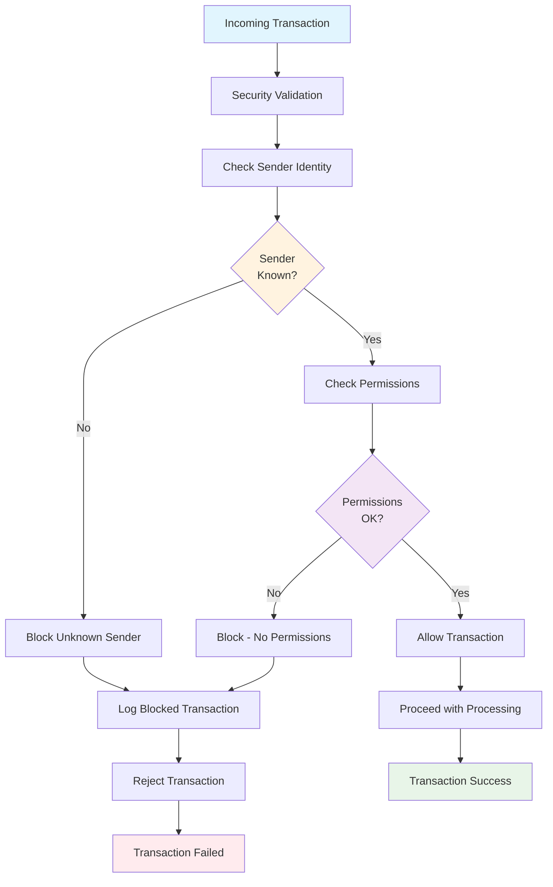
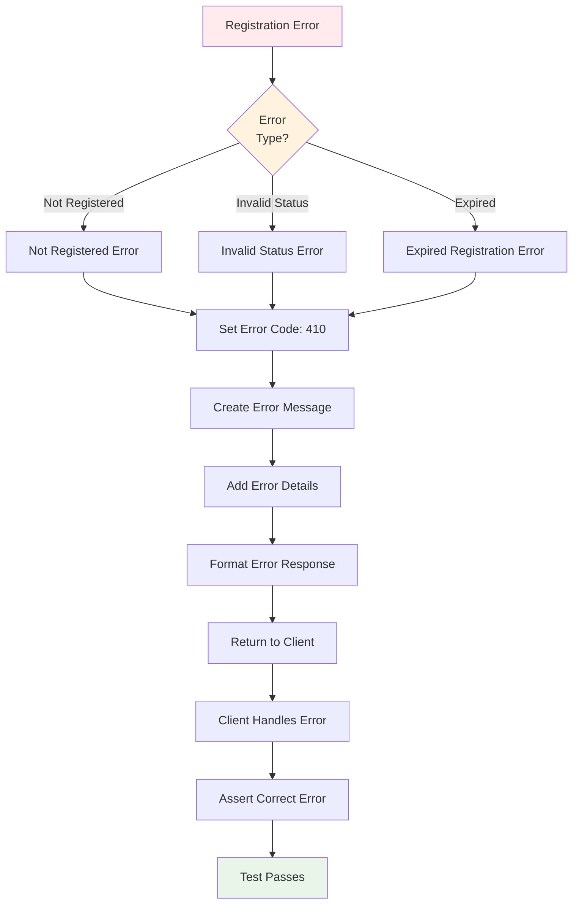

# Test Case 3: Payment From Unknown Sender

## Description
Simulate a transaction from a wallet that has not registered as an agent.

## Requirements
- On-chain transaction from unknown public key
- Contract check for registration should fail

## Sequence Diagram



## Test Flow



## HTTP API Calls

```mermaid
graph LR
    JEST[Jest Test] --> GET_BALANCE[GET /wallet/balance]
    JEST --> GET_TRANSACTION[GET /wallet/transaction/{id}]
    JEST --> GET_AGENT_INFO[GET /wallet/agent/{address}]
    JEST --> GET_REGISTRATION[GET /wallet/registration/{address}]
    JEST --> GET_ERROR[GET /wallet/error/{txId}]
    
    GET_BALANCE --> WALLET[Wallet Server]
    GET_TRANSACTION --> WALLET
    GET_AGENT_INFO --> WALLET
    GET_REGISTRATION --> WALLET
    GET_ERROR --> WALLET
    
    WALLET --> SERVICE[Wallet Service]
    SERVICE --> BLOCKCHAIN[Blockchain]
    
    style JEST fill:#e1f5fe
    style WALLET fill:#fff3e0
    style SERVICE fill:#f3e5f5
    style BLOCKCHAIN fill:#e8f5e8
```

## Registration Check Logic



## Unknown Sender Handling



## Security Validation Flow



## Error Response Structure

