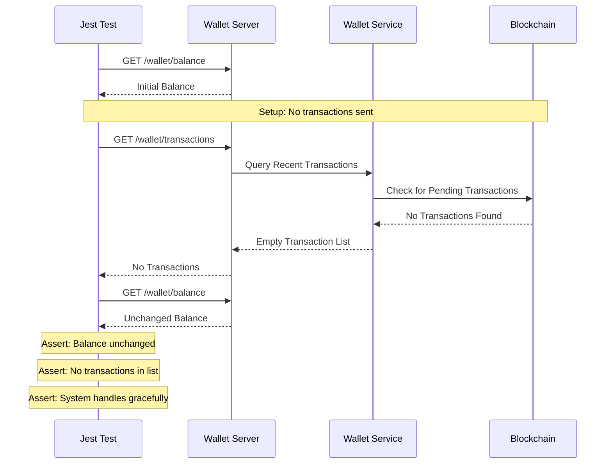
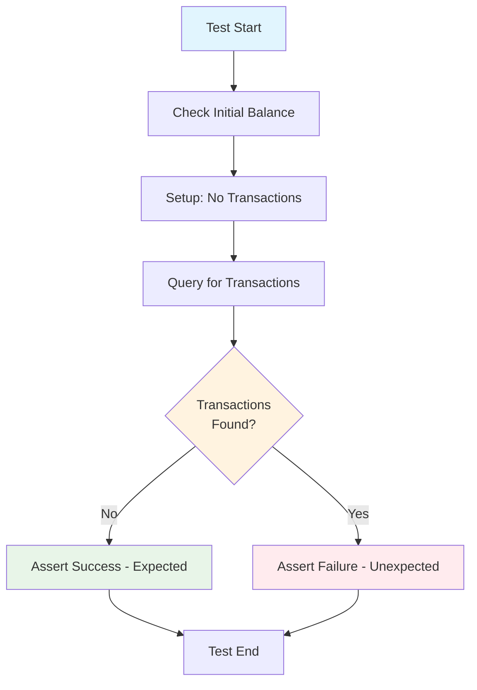
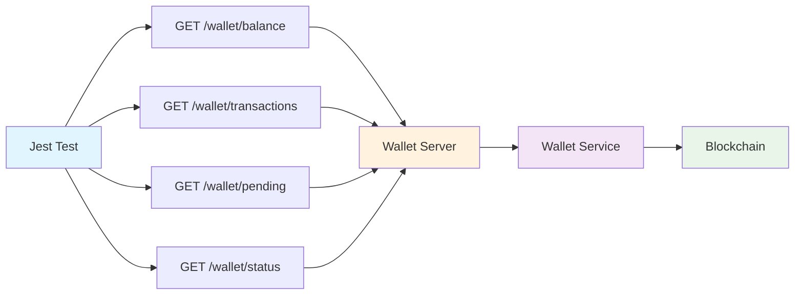
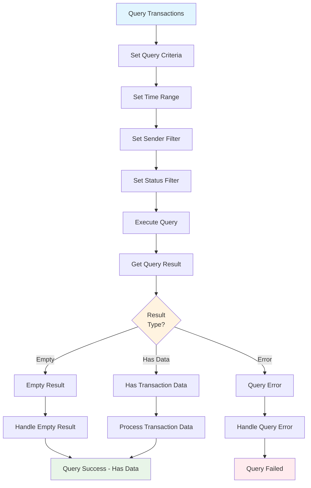
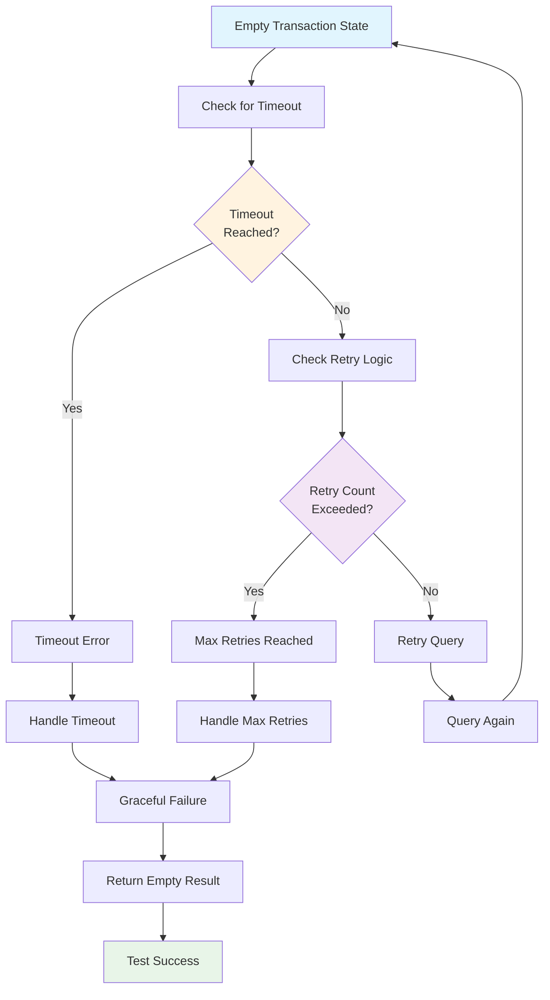
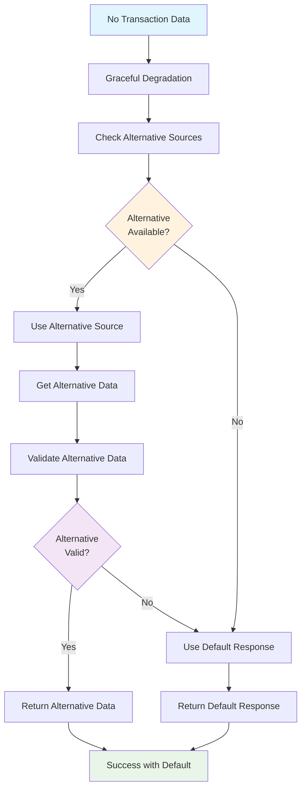
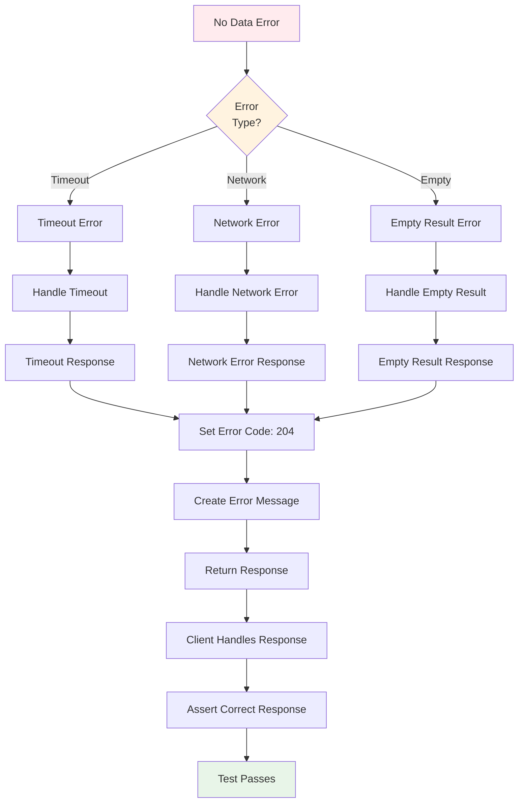

# Test Case 4: No Payment Received

## Description
Validate system behavior when no transaction matching the criteria is found.

## Requirements
- On-chain query returns no results
- Should handle timeout or failure gracefully

## Sequence Diagram

## Test Flow

## HTTP API Calls

## Transaction Query Logic

## Empty State Handling

## Graceful Degradation Flow

## Error Handling for No Data

