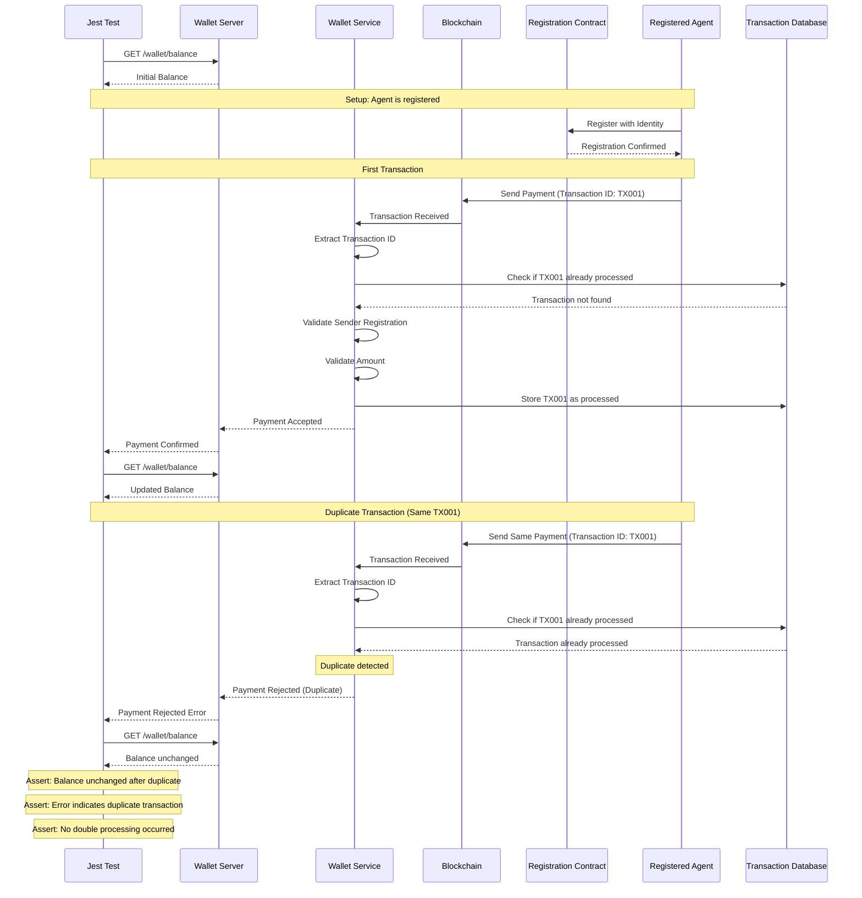
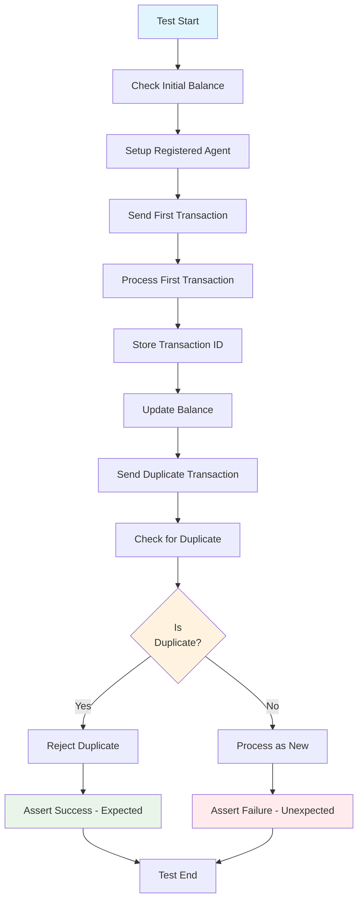
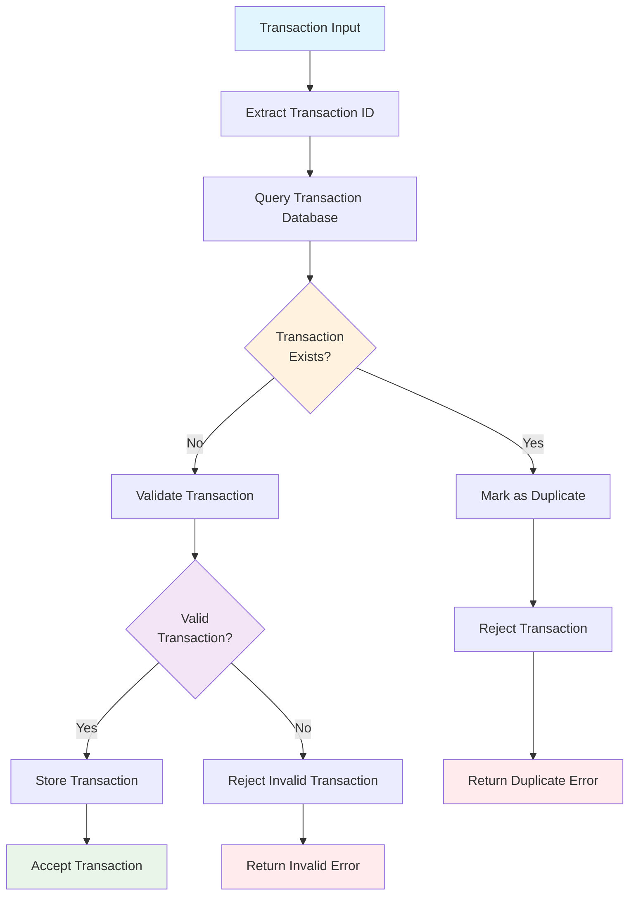
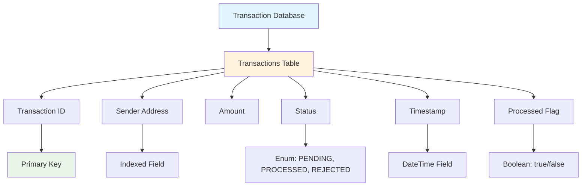
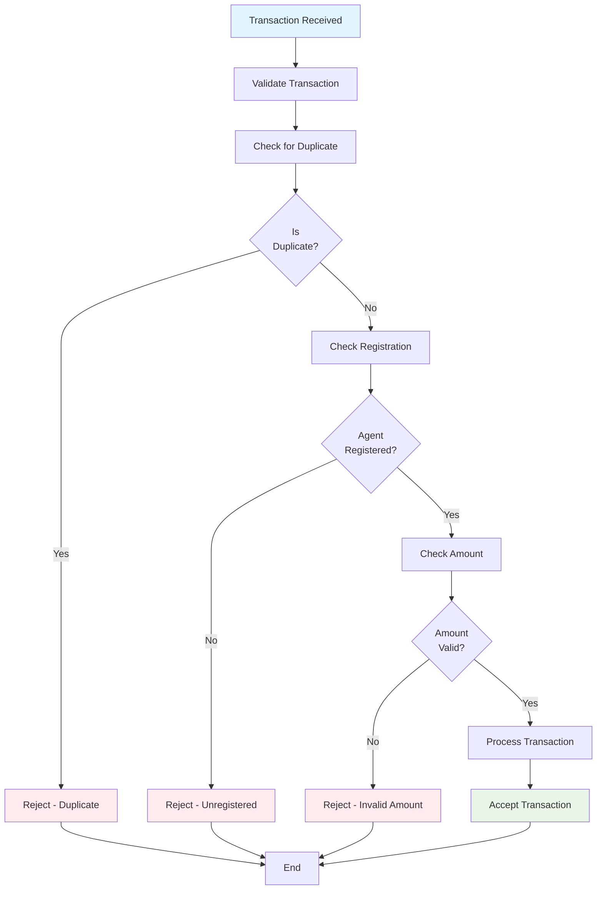

# Test Case 8: Duplicate Transaction Detection

## Description
Ensure the system detects and ignores repeated processing of the same transaction.

## Requirements
- Track already-processed transaction IDs
- Reject duplicates to avoid double processing

## Sequence Diagram



## Test Flow



## Duplicate Detection Logic



## HTTP API Calls

```mermaid
graph LR
    JEST[Jest Test] --> GET_BALANCE[GET /wallet/balance]
    JEST --> GET_TRANSACTION[GET /wallet/transaction/{id}]
    JEST --> GET_TRANSACTIONS[GET /wallet/transactions]
    JEST --> POST_TRANSACTION[POST /wallet/transaction]
    JEST --> GET_PROCESSED[GET /wallet/processed/{txId}]
    
    GET_BALANCE --> WALLET[Wallet Server]
    GET_TRANSACTION --> WALLET
    GET_TRANSACTIONS --> WALLET
    POST_TRANSACTION --> WALLET
    GET_PROCESSED --> WALLET
    
    WALLET --> SERVICE[Wallet Service]
    SERVICE --> DB[Transaction Database]
    SERVICE --> BLOCKCHAIN[Blockchain]
    
    style JEST fill:#e1f5fe
    style WALLET fill:#fff3e0
    style SERVICE fill:#f3e5f5
    style DB fill:#e8f5e8
```

## Database Schema for Transaction Tracking



## Transaction Processing States

