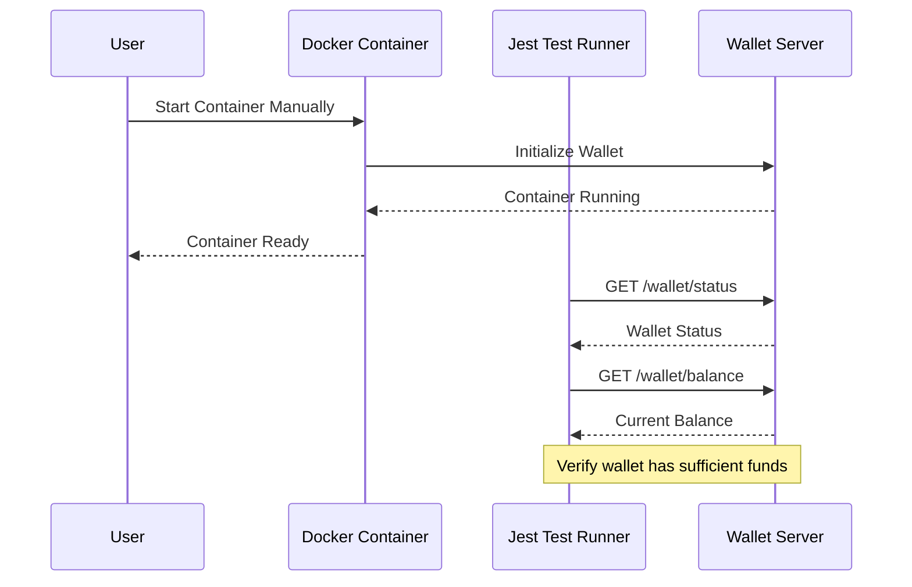
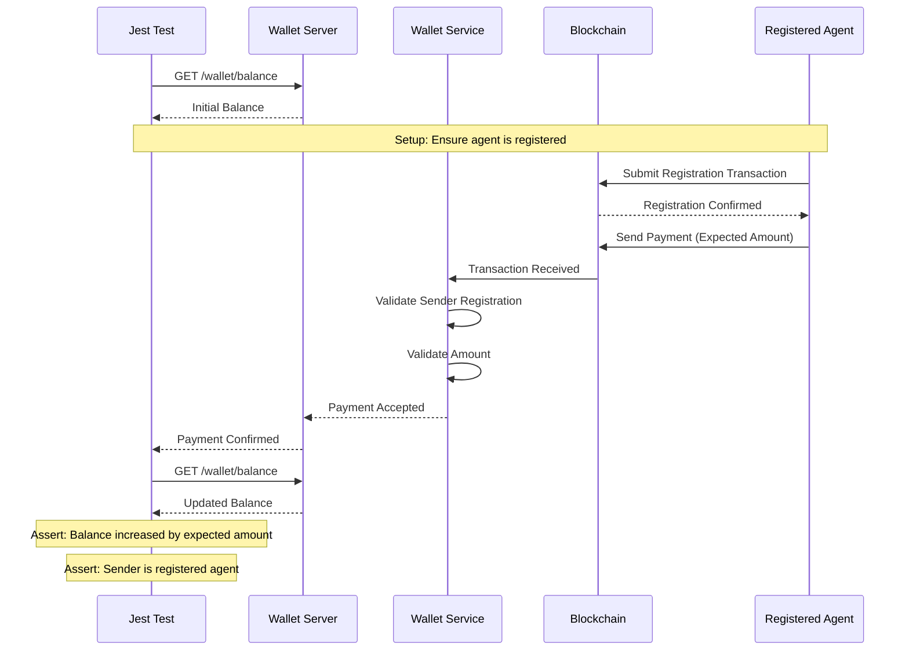
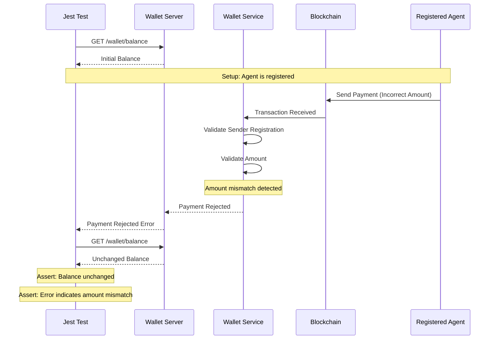
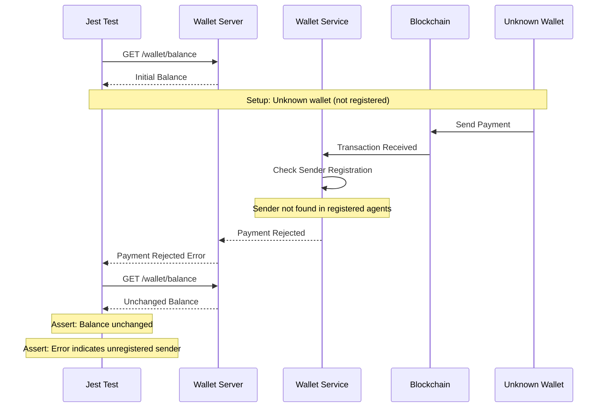
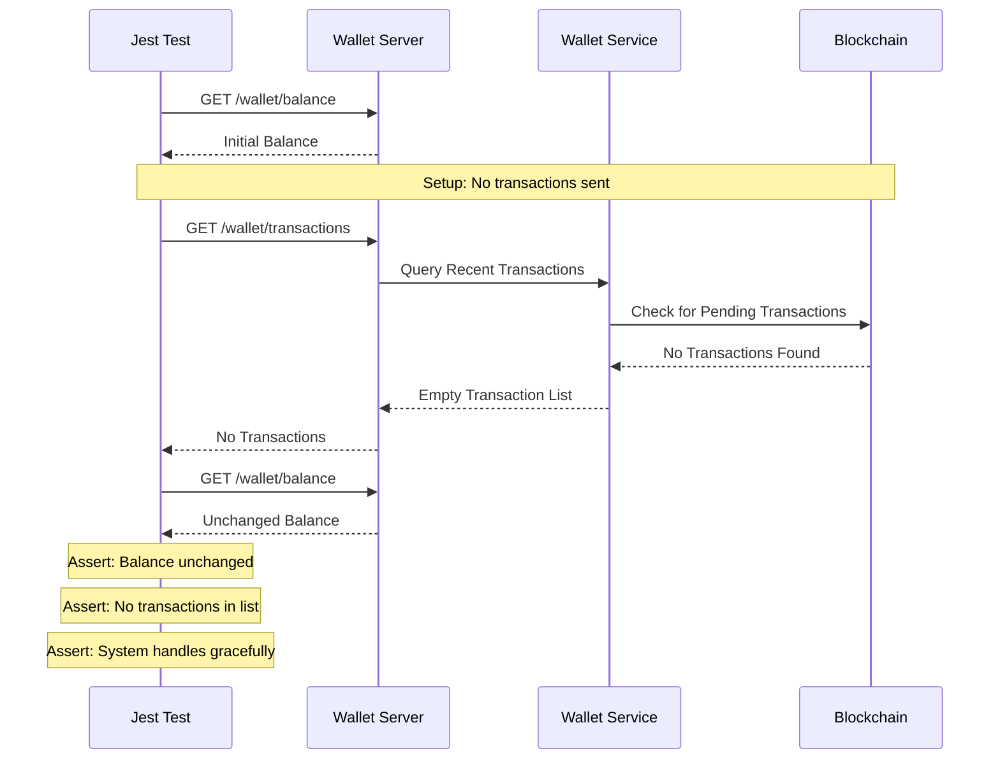
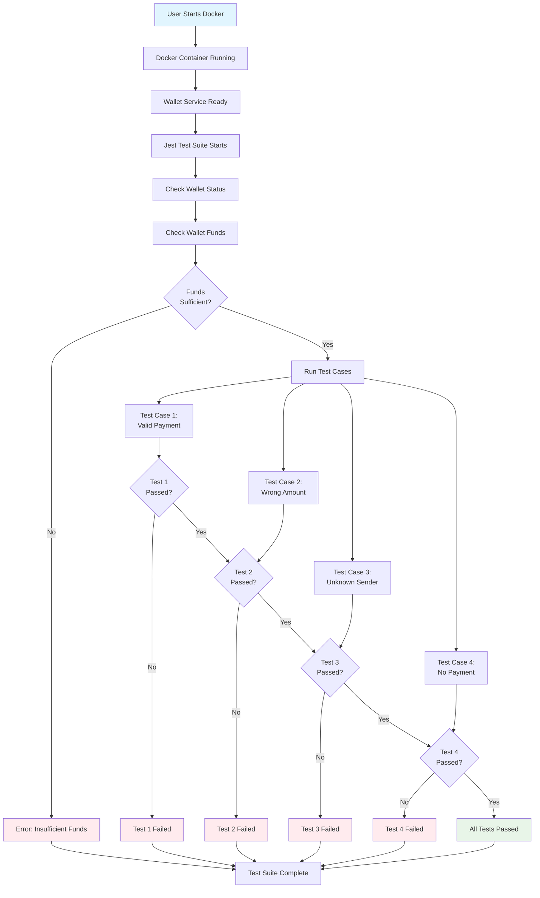
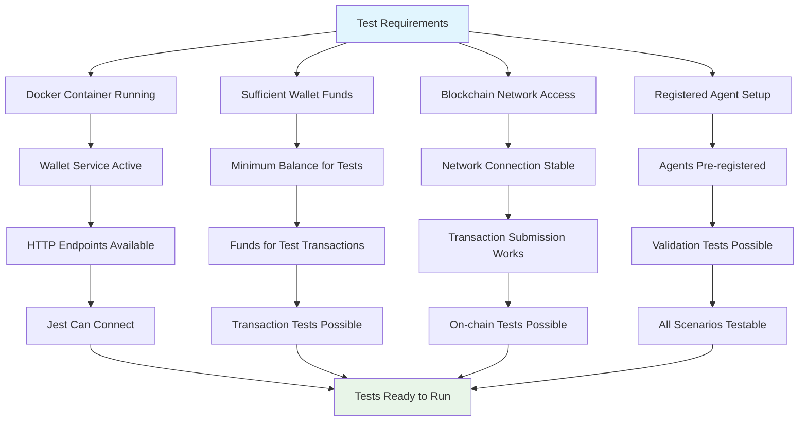

# Test Sequence Diagrams

This document contains Mermaid diagrams showing how the 4 test scenarios from `test-scenarios.txt` will be executed using Jest and HTTP calls to the manually started Docker wallet container.

## Test Setup Flow



## Test Case 1: Valid Payment Received



## Test Case 2: Payment With Wrong Amount



## Test Case 3: Payment From Unknown Sender



## Test Case 4: No Payment Received



## Complete Test Suite Flow



## HTTP API Endpoints Used in Tests

```mermaid
graph LR
    JEST[Jest Test Runner] --> GET_STATUS[GET /wallet/status]
    JEST --> GET_BALANCE[GET /wallet/balance]
    JEST --> GET_TRANSACTIONS[GET /wallet/transactions]
    JEST --> POST_SEND[POST /wallet/send]
    JEST --> GET_TRANSACTION[GET /wallet/transaction/{id}]
    
    GET_STATUS --> WALLET[Wallet Server]
    GET_BALANCE --> WALLET
    GET_TRANSACTIONS --> WALLET
    POST_SEND --> WALLET
    GET_TRANSACTION --> WALLET
    
    WALLET --> SERVICE[Wallet Service]
    SERVICE --> BLOCKCHAIN[Blockchain Network]
    
    style JEST fill:#e1f5fe
    style WALLET fill:#fff3e0
    style SERVICE fill:#f3e5f5
    style BLOCKCHAIN fill:#e8f5e8
```

## Test Environment Requirements

