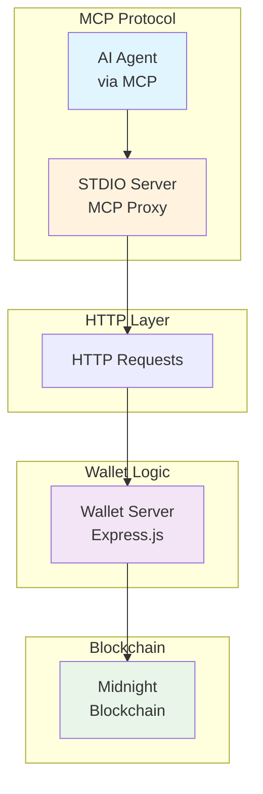

# Midnight Wallet MCP API Documentation

This document defines the API methods exposed by the **Midnight Wallet MCP** module for integration with Eliza AI agents.

The Wallet MCP consists of two components:
1. **Wallet Server** (`server.ts`) - An Express.js HTTP server that runs the wallet logic and exposes REST API endpoints
2. **STDIO Server** (`stdio-server.ts`) - An MCP-compliant server that acts as a proxy, forwarding tool calls to the wallet server via HTTP requests

---

## Architecture Overview



The STDIO server receives MCP tool calls from AI agents and forwards them as HTTP requests to the wallet server, which performs the actual wallet operations and returns the results.

---

## General Behavior
- The Wallet Service **initializes at startup**, loading or creating a wallet from local storage.
- Wallet **must fully sync** with the Midnight blockchain before operations can succeed.
- **Most MCP calls do not block**; if the wallet is not ready, an error response is immediately returned.
- Transactions follow a state lifecycle: INITIATED → SENT → COMPLETED (or FAILED).

---

## Configuration

### Environment Variables

The following environment variables can be used to configure the Wallet MCP:

| Variable | Description | Default | Required |
|----------|-------------|---------|----------|
| `AGENT_ID` | Unique identifier for the agent | - | Yes |
| `WALLET_SERVER_HOST` | Hostname or IP of the wallet server | `localhost` | No |
| `WALLET_SERVER_PORT` | Port number for the wallet server | `3000` | No |
| `NETWORK_ID` | Midnight network to connect to | `TestNet` | No |
| `WALLET_FILENAME` | Name of the wallet file | `midnight-wallet` | No |
| `LOG_LEVEL` | Logging level | `info` | No |
| `USE_EXTERNAL_PROOF_SERVER` | Whether to use external proof server | `false` | No |
| `PROOF_SERVER` | URL of the proof server | - | If `USE_EXTERNAL_PROOF_SERVER=true` |
| `INDEXER` | URL of the indexer | - | If `USE_EXTERNAL_PROOF_SERVER=true` |
| `INDEXER_WS` | WebSocket URL of the indexer | - | If `USE_EXTERNAL_PROOF_SERVER=true` |
| `MN_NODE` | URL of the Midnight node | - | If `USE_EXTERNAL_PROOF_SERVER=true` |

### Example .env File

```env
# Required
AGENT_ID=my-agent-1

# Optional - Server Configuration
WALLET_SERVER_HOST=wallet-server  # Use 'localhost' for local development
WALLET_SERVER_PORT=3000          # Must match the port exposed in Docker

# Optional - Network Configuration
NETWORK_ID=TestNet
WALLET_FILENAME=midnight-wallet
LOG_LEVEL=info

# Optional - External Services
USE_EXTERNAL_PROOF_SERVER=true
PROOF_SERVER=http://proof-server:8080
INDEXER=http://indexer:8080
INDEXER_WS=ws://indexer:8080
MN_NODE=http://midnight-node:8080
```

### Docker Configuration

When running in Docker, make sure to:

1. Expose the wallet server port in your Dockerfile:
```dockerfile
EXPOSE 3000
```

2. Set the `WALLET_SERVER_HOST` to the service name in your Docker network:
```env
WALLET_SERVER_HOST=wallet-server
```

3. Ensure the port matches between:
   - The exposed port in Dockerfile
   - The `WALLET_SERVER_PORT` environment variable
   - The port your wallet server is listening on

---

## API Methods

### `walletStatus`
**Purpose:**
- Gets detailed wallet status including sync progress, readiness, and recovery state.

**Parameters:**
- None

**Returns:**
- WalletStatus object containing:
  - `ready`: Whether the wallet is ready for operations
  - `syncing`: Whether the wallet is currently syncing
  - `syncProgress`: Sync progress information
  - `address`: The wallet's address
  - `balances`: Current wallet balances
  - `recovering`: Whether the wallet is in recovery mode
  - `recoveryAttempts`: Number of recovery attempts
  - `maxRecoveryAttempts`: Maximum number of recovery attempts
  - `isFullySynced`: Whether the wallet is fully synced

**Error Handling:**
- If issues retrieving status: returns error `WALLET_NOT_READY`.

---

### `walletAddress`
**Purpose:**
- Returns the wallet's receiving address.

**Parameters:**
- None

**Returns:**
- Object containing:
  - `address`: Base address of the wallet

**Error Handling:**
- If wallet has issues: returns error `WALLET_NOT_READY`.

---

### `walletBalance`
**Purpose:**
- Retrieves the wallet's available balance.

**Parameters:**
- None

**Returns:**
- WalletBalances object containing:
  - `balance`: Available spendable funds (as a string)
  - `pendingBalance`: Funds that are not yet available for spending (as a string)

**Error Handling:**
- If wallet is not ready: returns error `WALLET_NOT_READY`.

---

### `sendFunds(destinationAddress: string, amount: string)`
**Purpose:**
- Initiates a non-blocking transaction to send funds to a destination address.

**Parameters:**
- `destinationAddress`: Address to send funds to.
- `amount`: Amount to transfer (as a string).

**Returns:**
- InitiateTransactionResult object containing:
  - `id`: UUID for the transaction record
  - `state`: Current state (INITIATED)
  - `toAddress`: Recipient address
  - `amount`: Amount to be sent
  - `createdAt`: Timestamp of creation

**Error Handling:**
- If wallet is not ready: returns error `WALLET_NOT_READY`.
- If transaction initialization fails: returns error `TX_SUBMISSION_FAILED`.

---

### `verifyTransaction(identifier: string)`
**Purpose:**
- Verifies if a transaction with the specified identifier has been received by the wallet.

**Parameters:**
- `identifier`: The transaction identifier to verify.

**Returns:**
- TransactionVerificationResult object containing:
  - `exists`: Whether the transaction exists
  - `syncStatus`: Current sync status information

**Error Handling:**
- If wallet is not ready: returns error `WALLET_NOT_READY`.
- If verification fails: returns error `IDENTIFIER_VERIFICATION_FAILED`.

---

### `getTransactionStatus(transactionId: string)`
**Purpose:**
- Gets the current status of a transaction by its ID.

**Parameters:**
- `transactionId`: ID of the transaction to check.

**Returns:**
- TransactionStatusResult object containing:
  - `transaction`: The transaction record
  - `blockchainStatus`: Current blockchain status of the transaction if available

**Error Handling:**
- If wallet is not ready: returns error `WALLET_NOT_READY`.
- If transaction not found: returns error `TX_NOT_FOUND`.

---

### `getTransactions()`
**Purpose:**
- Gets all transactions.

**Parameters:**
- None

**Returns:**
- Array of TransactionRecord objects.

**Error Handling:**
- If wallet is not ready: returns error `WALLET_NOT_READY`.

---

### `getWalletConfig()`
**Purpose:**
- Gets the configuration of the wallet NODE and Indexer.

**Parameters:**
- None

**Returns:**
- Object containing wallet configuration information.

**Error Handling:**
- If wallet is not ready: returns error `WALLET_NOT_READY`.

---

## HTTP Endpoints

The wallet server exposes the following REST API endpoints:

| Method | Endpoint | Description |
|--------|----------|-------------|
| GET | `/wallet/status` | Get wallet status |
| GET | `/wallet/address` | Get wallet address |
| GET | `/wallet/balance` | Get wallet balance |
| POST | `/wallet/send` | Send funds |
| POST | `/wallet/verify-transaction` | Verify transaction |
| GET | `/wallet/transaction/:transactionId` | Get transaction status |
| GET | `/wallet/transactions` | Get all transactions |
| GET | `/wallet/pending-transactions` | Get pending transactions |
| GET | `/wallet/config` | Get wallet configuration |
| GET | `/health` | Health check |

---

## Notes
- **Seed management is internal**: no external createWallet, exportSeed, or modifySeed operations are allowed.
- **State persistence**: Wallet state (seed, address, UTXOs) is saved locally to survive restarts.
- **Non-blocking design**: Most operations return immediately, transaction states can be tracked separately.
- **HTTP proxy**: The STDIO server acts as a proxy, forwarding MCP tool calls to the wallet server via HTTP requests.

---

## Error Types
- `WALLET_NOT_READY`: Wallet is not initialized or synced yet.
- `INSUFFICIENT_FUNDS`: Not enough funds for the requested transaction.
- `TX_SUBMISSION_FAILED`: Failed to submit the transaction to the network.
- `TX_NOT_FOUND`: The requested transaction ID was not found.
- `IDENTIFIER_VERIFICATION_FAILED`: Failed to verify transaction by identifier.

---

## Future Extensions
- Disclosed transactions via smart contracts.
- Proof of origin metadata.
- Multi-address management (advanced scenarios).

---

# End of Document
