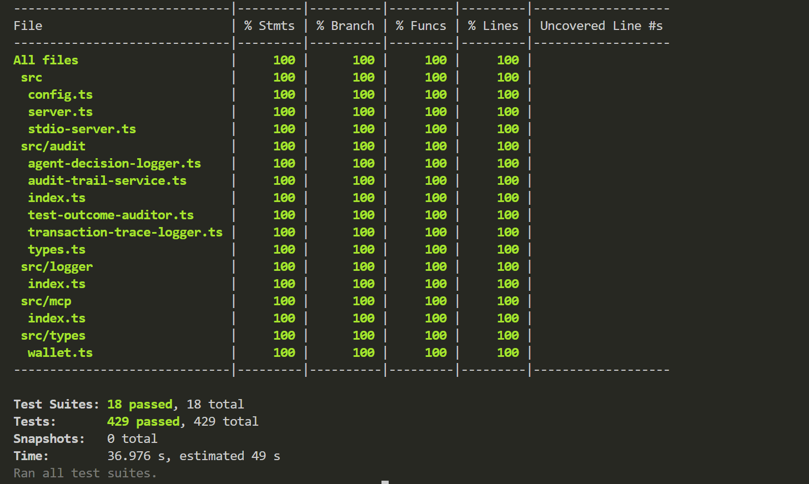

# 🧪 Unit Tests

Welcome to the unit tests for the Midnight MCP (Model Context Protocol) project! This directory contains comprehensive test coverage for all core components of the system.

## 📊 Test Coverage

Our unit tests maintain **100% coverage** across all metrics:

- **Statements:** 100%
- **Branches:** 100% 
- **Functions:** 100%
- **Lines:** 100%




## 🚀 Running Tests

### Run All Unit Tests
```bash
yarn test:unit
```

### Watch Mode (for development)
```bash
yarn test:watch
```

### Coverage Report
```bash
yarn test:coverage
```

### All Tests (unit + integration)
```bash
yarn test:all
```

## 📁 Test Structure

The unit tests are organized into the following modules:

### 🏗️ Core Components
- **`config.spec.ts`** - Configuration management tests
- **`index.spec.ts`** - Main entry point tests
- **`server.spec.ts`** - Server functionality tests
- **`stdio-server.spec.ts`** - STDIO server implementation tests

### 🔍 Audit System (`audit/`)
- **`audit-trail.spec.ts`** - Audit trail functionality (848 lines)
- **`transaction-trace-logger.spec.ts`** - Transaction tracing (451 lines)
- **`test-outcome-auditor.spec.ts`** - Test outcome auditing (202 lines)
- **`index.test.spec.ts`** - Audit module integration

### 🖥️ Server Module (`server/`)
- **`server.spec.ts`** - Core server logic (328 lines)
- **`main-module.spec.ts`** - Main module initialization (129 lines)
- **`index.spec.ts`** - Server integration tests (875 lines)
- **`startup.spec.ts`** - Server startup procedures (309 lines)

### 💰 Wallet System (`wallet/`)
- **`index.spec.ts`** - Wallet core functionality (716 lines)
- **`event-parsing.spec.ts`** - Event parsing logic (374 lines)
- **`transaction-lifecycle.spec.ts`** - Transaction management (599 lines)
- **`network-reconnection.spec.ts`** - Network resilience (521 lines)

### 🔌 MCP Integration (`mcp/`)
- **`index.spec.ts`** - MCP protocol implementation (773 lines)

### 📝 Logger System (`logger/`)
- **`index.spec.ts`** - Logging functionality (640 lines)

## 🎭 Mock System

The test suite includes a comprehensive mocking system located in `__mocks__/`:

### Core Mocks
- **`logger.ts`** - Logger mock implementation
- **`file-manager.ts`** - File system operations
- **`audit.ts`** - Audit system mocks
- **`wallet.ts`** - Wallet functionality mocks
- **`config.ts`** - Configuration mocks

### Third-party Mocks
- **`@midnight-ntwrk/`** - Midnight Network SDK mocks
  - `ledger.ts` - Ledger operations
  - `wallet.ts` - Wallet SDK mocks
- **`midnight-js-network-id.ts`** - Network ID utilities
- **`TransactionDatabase.ts`** - Database operations

## 📈 Test Statistics

- **Test Suites:** 18 passed, 18 total
- **Tests:** 429 passed, 429 total
- **Snapshots:** 0 total
- **Execution Time:** ~37 seconds

## 🧪 Test Categories

### Unit Tests Focus Areas

1. **Configuration Management**
   - Environment variable handling
   - Configuration validation
   - Default value assignments

2. **Server Operations**
   - HTTP request handling
   - WebSocket connections
   - Error handling and recovery
   - Startup and shutdown procedures

3. **Wallet Integration**
   - Transaction creation and signing
   - Balance queries
   - Event parsing and handling
   - Network reconnection logic

4. **Audit Trail**
   - Transaction logging
   - Audit event generation
   - Test outcome recording
   - Trace collection

5. **MCP Protocol**
   - Tool registration and execution
   - Message handling
   - Protocol compliance

6. **Logging System**
   - Log level management
   - Output formatting
   - Performance monitoring

## 🛠️ Writing Tests

### Test Structure
Tests follow the **Arrange-Act-Assert** pattern:

```typescript
describe('ComponentName', () => {
  beforeEach(() => {
    // Arrange: Set up test environment
  });

  it('should perform expected behavior', async () => {
    // Arrange: Prepare test data
    const input = createTestInput();
    
    // Act: Execute the functionality
    const result = await componentUnderTest.method(input);
    
    // Assert: Verify the outcome
    expect(result).toEqual(expectedOutput);
  });
});
```

### Mock Usage
Leverage the existing mock system:

```typescript
import { mockLogger } from '../__mocks__/logger';
import { mockWallet } from '../__mocks__/wallet';

// Use mocks in your tests
mockLogger.info.mockClear();
mockWallet.getBalance.mockResolvedValue(BigInt(1000));
```

### Property-Based Testing
The project uses `fast-check` for property-based testing:

```typescript
import fc from 'fast-check';

it('should handle any valid input', () => {
  fc.assert(
    fc.property(fc.string(), (input) => {
      const result = processInput(input);
      expect(result).toBeDefined();
    })
  );
});
```

## 🔧 Test Configuration

Tests are configured in `jest.config.js` with:
- TypeScript support via `ts-jest`
- Mock resolution for ES modules
- Coverage collection from `src/` directory
- Test environment setup

## 🚨 Troubleshooting

### Common Issues

1. **Mock not working**: Ensure mock files are in `__mocks__/` and properly exported
2. **Async test failures**: Use `await` for promises and `done()` callbacks appropriately
3. **Module resolution**: Check import paths and ensure they match the actual file structure
